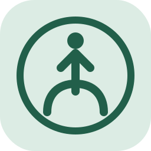
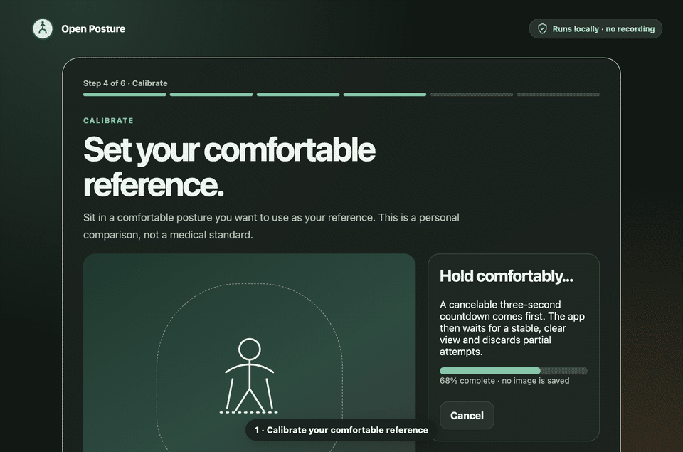
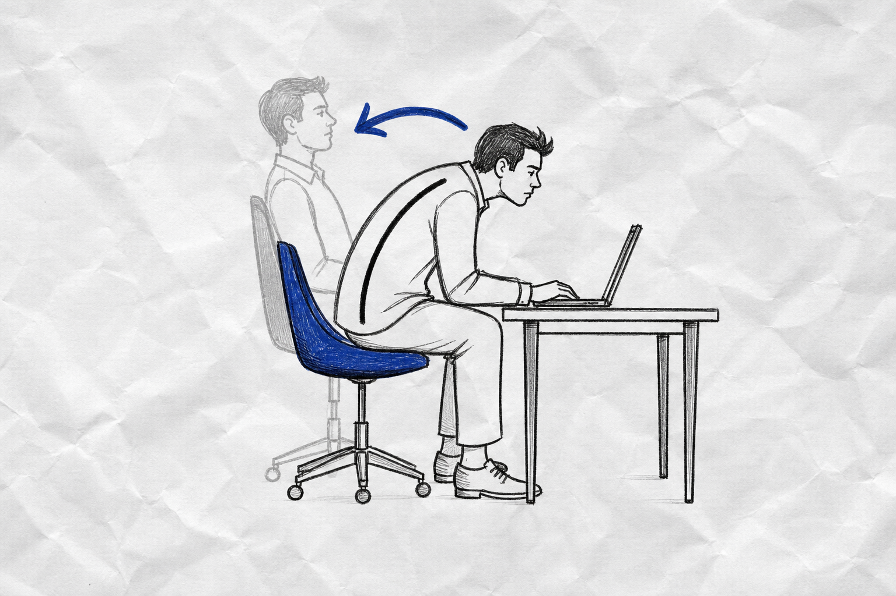
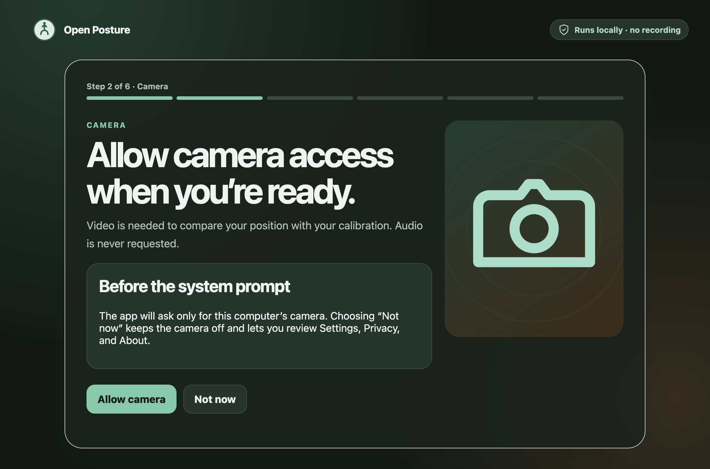
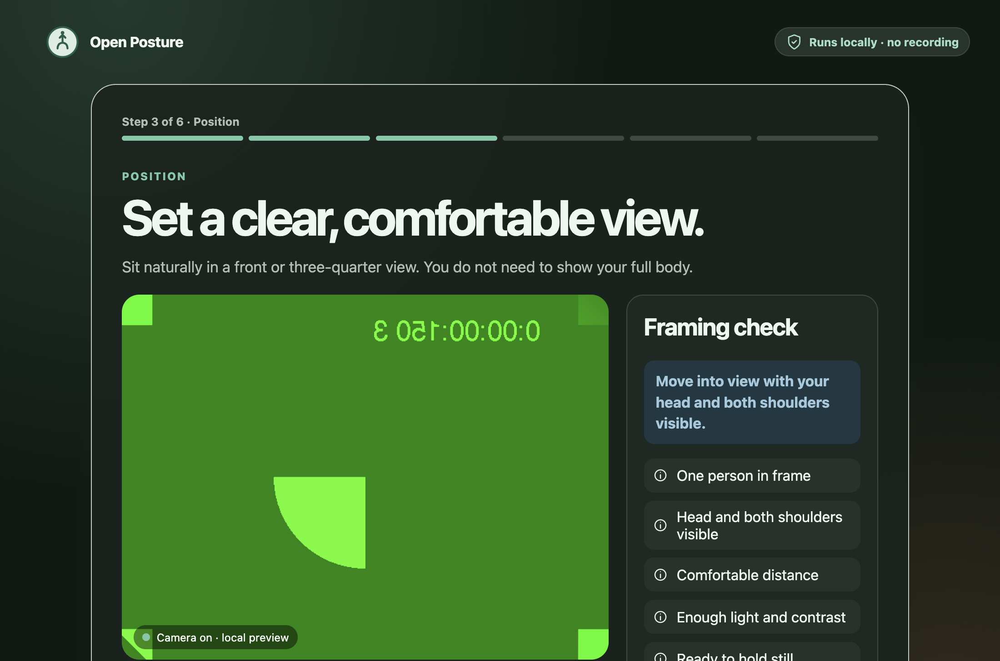
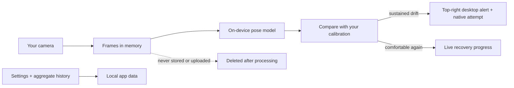
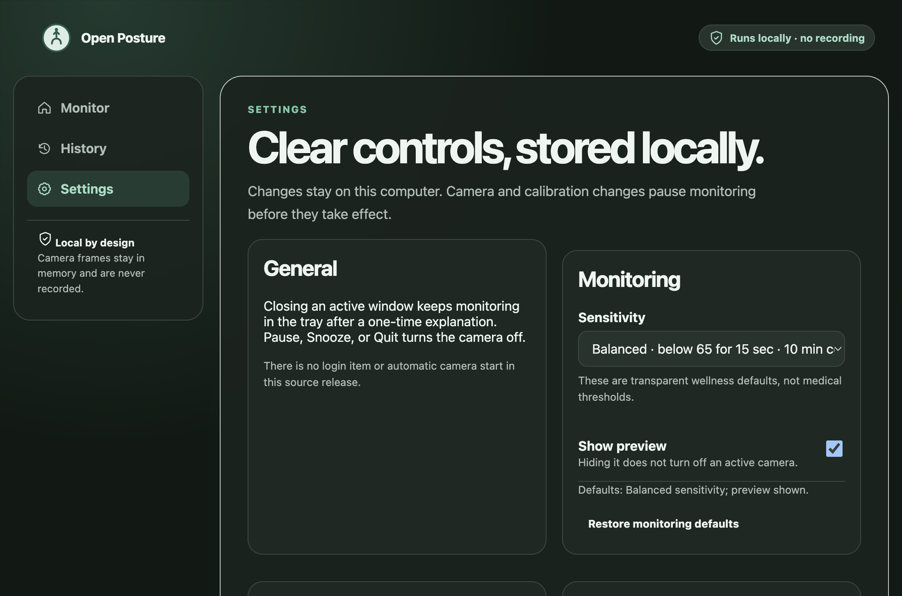

<div align="center">
  
  <h1>Open Posture</h1>
  <p><strong>A private, open-source posture companion that runs entirely on your computer.</strong></p>
  <p>Calibrate what comfortable means for you. Get a gentle nudge when you drift for too long.</p>

  <p>
    <a href="https://github.com/whatnotbot/open-posture/actions/workflows/ci.yml"></a>
    <a href="https://github.com/whatnotbot/open-posture/actions/workflows/codeql.yml"></a>
    <a href="LICENSE"></a>
    
    <a href="https://github.com/whatnotbot/open-posture/stargazers"></a>
  </p>

  <p>
    <a href="#quick-start">Quick start</a> ·
    <a href="#how-it-works">How it works</a> ·
    <a href="#features">Features</a> ·
    <a href="#privacy-by-construction">Privacy</a> ·
    <a href="#platform-status">Platforms</a> ·
    <a href="CONTRIBUTING.md">Contribute</a>
  </p>
</div>

<p align="center">
  
</p>

<p align="center"><sub>Calibrate → start monitoring → notice sustained drift → receive a gentle alert → recover</sub></p>

Open Posture uses an on-device pose model to notice sustained changes from a comfortable position that **you** choose. It does not upload camera frames, need an account, or decide there is one universally “correct” posture.

> [!IMPORTANT]
> Open Posture is an early open-source release candidate, not a medical device. Its score measures similarity to your personal calibration; it is not a health score, diagnosis, or treatment recommendation.

## Why Open Posture?

- **Personal, not prescriptive.** You calibrate a comfortable reference instead of conforming to a universal pose.
- **Calm by default.** A reminder appears only after sustained, assessable drift—not every time you move.
- **Useful correction.** The app names the strongest change and shows live recovery progress.
- **Private by construction.** Video and raw pose landmarks stay in memory on your device.
- **No service to trust.** No account, backend, telemetry, ads, subscription, or API key.
- **Yours to inspect.** The model, behavior, tests, architecture, and release process are in this repository.

<p align="center">
  
</p>

## Quick start

You need:

- macOS 13+, Windows 11, or a modern Linux desktop;
- Git;
- [Node.js 24](https://nodejs.org/) (`24.11.0` or newer in the 24.x line);
- npm 11;
- a camera and a graphical desktop session.

No API key, Docker, Python, Rust, database, or global npm package is required.

```bash
git clone https://github.com/whatnotbot/open-posture.git
cd open-posture
npm ci --ignore-scripts
npm run model:verify
npm start
```

The first install and launch need internet access to download the pinned dependencies and Electron runtime. Source setup skips third-party install scripts; `npm start` explicitly verifies the toolchain and installs the pinned Electron binary. Normal app operation is local and blocks external runtime network traffic.

### macOS

Run the universal quick-start commands in Terminal. On first launch, macOS asks for camera access; Open Posture never requests microphone access.

To build the drag-to-Applications installer on a Mac:

```bash
npm ci
npm run check
npm run make:mac
```

Open `out/make/Open Posture-0.1.0-<arch>.dmg`, drag **Open Posture** into **Applications**, then eject the disk image. `<arch>` is `arm64` on Apple silicon or `x64` on Intel.

The local DMG is ad-hoc signed, not Apple-notarized. It is appropriate for local testing, but a public binary release still needs Developer ID signing, notarization, stapling, and download verification. Do not disable Gatekeeper. See [macOS distribution](docs/macos-distribution.md).

### Windows

Use PowerShell or Command Prompt—not WSL—so Electron can access the Windows desktop and camera:

```powershell
git clone https://github.com/whatnotbot/open-posture.git
Set-Location open-posture
npm ci --ignore-scripts
npm run model:verify
npm start
```

Allow camera access when Windows asks. If access was previously denied, enable it under **Settings → Privacy & security → Camera**. Windows currently runs from source; there is no checked-in or verified Windows installer yet. See [Windows testing](docs/testing-windows.md).

### Linux

Run the universal quick start in a terminal from an X11 or Wayland desktop session:

```bash
git clone https://github.com/whatnotbot/open-posture.git
cd open-posture
npm ci --ignore-scripts
npm run model:verify
npm start
```

Your desktop must expose a camera to Chromium/Electron and allow desktop notifications. Linux currently runs from source; there is no checked-in or verified AppImage, `.deb`, RPM, Flatpak, or Snap package yet. See [troubleshooting](docs/troubleshooting.md) and the [manual smoke checklist](docs/manual-smoke.md).

## First run

1. Read the short privacy explanation.
2. Explicitly enable the camera and choose a device.
3. Position your head, shoulders, and upper torso inside the guide.
4. Sit in a comfortable position and capture your personal calibration.
5. Start monitoring, then minimize or close the main window. The menu-bar/tray icon stays available while monitoring continues.

When sustained drift crosses your chosen sensitivity, Open Posture plays one system alert sound and shows a non-focus-stealing alert at the active monitor’s top-right—even while the main window is hidden. It alerts once per sustained episode, not on every camera frame, and becomes eligible for a future episode after recovery and cooldown. It also attempts a native notification. Open the correction screen for a neutral directional cue, or pause and snooze whenever you want.

<table>
  <tr>
    <td width="50%"></td>
    <td width="50%"></td>
  </tr>
  <tr>
    <td align="center"><strong>Camera starts only after consent</strong></td>
    <td align="center"><strong>Positioning guidance before calibration</strong></td>
  </tr>
</table>

## How it works



The model estimates pose landmarks in a renderer worker. Pure TypeScript logic qualifies the frame, derives relative features, smooths noise, and decides whether a change has lasted long enough to matter. Only settings, derived calibration measurements, aggregate minute history, and capped sanitized lifecycle logs may be persisted.

Read the [algorithm](docs/algorithm.md), [model notes](docs/model.md), and [architecture](docs/architecture.md) for the exact behavior.

## Features

| Area | What Open Posture provides |
|---|---|
| Calibration | A personal reference captured only after stable, assessable framing |
| Monitoring | Smoothed, confidence-aware comparison with your reference |
| Alerts | Always-on-top desktop alert, one system sound per episode, and a best-effort native notification |
| Correction | Neutral directional cue, strongest-change explanation, and recovery progress |
| Control | Pause, snooze, sensitivity, camera selection, tray actions, and reset |
| History | Local aggregate minute history—never stored frames or raw landmarks |
| Privacy | Runtime network denial, camera-only permission, local processing, and granular deletion |
| Accessibility | Keyboard operation, visible focus, status semantics, reduced-motion support, and readable correction states |
| Reliability | Camera reconnect handling, stale-event protection, alert cooldowns, and lifecycle cleanup |

<p align="center">
  
</p>

## Privacy by construction

- Camera frames and raw pose landmarks are never stored, logged, uploaded, or sent across privileged Electron IPC.
- Runtime external HTTP(S) and WebSocket traffic is blocked.
- The sandboxed renderer is served only from a path-confined custom application origin, never a privileged `file://` page.
- Packaged builds disable Electron Run-as-Node, Node option/inspector injection, and extra file-protocol privileges, then enforce ASAR integrity/loading.
- Microphone, downloads, untrusted navigation, new windows, and unrelated permissions are denied.
- Pause, snooze, lock, sleep, reset, fatal capture errors, and quit stop camera capture.
- Settings, calibration, history, and all local app data can be deleted from the app.
- There is no analytics SDK, crash-report upload, account, advertising identifier, or cloud endpoint.

Read the exact [privacy model](docs/privacy.md) and [local data inventory](docs/data.md).

## Platform status

| Platform | Run from source | Installer | Current evidence |
|---|:---:|:---:|---|
| macOS 13+ · Apple silicon | ✅ CI-tested | Local DMG | Hosted CI plus a local arm64 build, artifact verification, and synthetic-camera smoke pass |
| macOS 13+ · Intel | ✅ CI-tested | DMG build command | Hosted Intel build/smoke pass; physical camera and installed-DMG verification are still wanted |
| Windows 11 · x64 | ✅ CI-tested | Not yet | Hosted Windows build and synthetic-camera smoke pass; physical camera, tray, and notification verification are still wanted |
| Windows 11 · ARM64 | Experimental | Not yet | Community verification wanted |
| Ubuntu 24.04 · x64 | ✅ CI-tested | Not yet | Hosted Xvfb build/smoke pass; physical X11/Wayland camera, notification, and tray verification are still wanted |

“Candidate” means the code and checks exist, not that every camera, compositor, notification system, or permission configuration has been verified. Please return results using the [platform verification issue template](.github/ISSUE_TEMPLATE/platform.yml).

## Development

```bash
npm run typecheck
npm test
npm run test:coverage
npm run build
npm run test:smoke
```

Run every release-blocking local check with:

```bash
npm run check
```

The deterministic suite covers posture logic, renderer views, storage, lifecycle, accessibility, and security boundaries. Enforced branch coverage is 91.10% for the posture engine and at least 80% across shared pure TypeScript logic. The Electron smoke suite uses a synthetic video-only camera and an isolated profile to test consent, capture, runtime network denial, accessibility semantics, local storage boundaries, and camera cleanup.

GitHub Actions runs on Apple silicon macOS, Intel macOS, Windows, and Ubuntu; the live badge above reflects the latest `main` result. See the [testing strategy](docs/testing.md), [manual smoke checklist](docs/manual-smoke.md), and [release process](docs/release-process.md) for the evidence behind those claims.

## Project structure

```text
src/main/        Electron lifecycle, permissions, storage, tray, notifications
src/preload/     Small typed bridge between renderer and privileged APIs
src/renderer/    Views, camera controller, pose worker, and local product state
src/shared/      Pure posture engine and shared contracts
tests/           Deterministic, security, lifecycle, and Electron smoke tests
docs/            Architecture, privacy, testing, release, and platform guides
assets/          Original icons and checksum-pinned on-device pose model
```

## Contributing

Bug reports, focused features, platform verification, documentation, accessibility improvements, and tests are welcome. Start with [CONTRIBUTING.md](CONTRIBUTING.md) and the [roadmap](ROADMAP.md).

Please never post personal webcam recordings, raw landmarks, identifying device information, or unreviewed diagnostics. Report security and privacy vulnerabilities privately using [SECURITY.md](SECURITY.md).

If Open Posture helps you, **[star the repository](https://github.com/whatnotbot/open-posture)** so more people can find it.

## FAQ

<details>
<summary><strong>Does Open Posture record me?</strong></summary>

No. Frames are processed in memory and discarded. The app stores no video, photos, or raw pose landmarks.
</details>

<details>
<summary><strong>Does it need the internet?</strong></summary>

Only for cloning and downloading pinned dependencies during setup. External runtime traffic is blocked.
</details>

<details>
<summary><strong>Is this medical advice?</strong></summary>

No. Open Posture compares your current pose with a personal calibration. It does not diagnose, treat, or prescribe.
</details>

<details>
<summary><strong>Why is there no Windows or Linux installer yet?</strong></summary>

The source path is ready for community testing, but publishing trustworthy installers requires platform-specific packaging, signing, CI evidence, and physical-device verification. The project does not claim those are complete before they are.
</details>

## License

Apache License 2.0. See [LICENSE](LICENSE), [NOTICE](NOTICE), and [THIRD_PARTY_NOTICES.md](THIRD_PARTY_NOTICES.md).

<div align="center">
  <sub>Built in the open, processed on your device, maintained by contributors.</sub>
</div>
