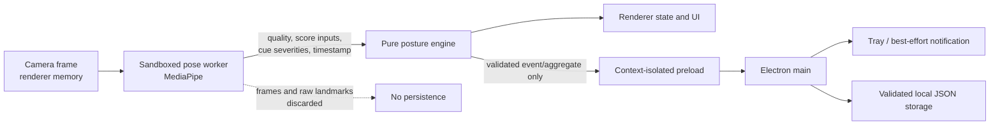

# Architecture

Open Posture is an Electron desktop application that runs from source on macOS, Windows, and Linux and can be packaged as a macOS DMG. It has one privileged main process, one narrow preload bridge, a sandboxed renderer, a local pose worker, and pure deterministic posture logic. There is no backend, account, updater, telemetry service, or runtime network dependency.

## Trust boundaries

### Electron main process

`src/main/` owns operating-system authority:

- creates the single sandboxed window;
- enforces one running instance;
- denies unexpected permissions, navigation, downloads, and runtime requests;
- owns tray, notifications, suspend/lock handling, and Quit;
- validates every IPC request;
- owns atomic settings/history storage, recovery, retention, diagnostics, and deletion.

The main process never receives a camera frame or raw landmark array.

### Preload bridge

`src/preload/` exposes a typed `DesktopApi` through `contextBridge`. It is an allowlist, not a general RPC layer. Current messages cover runtime/capabilities, validated monitoring state, fixed notification events, allowlisted external links, and typed desktop lifecycle events.

Do not add arbitrary filesystem paths, URLs, notification text, shell commands, frame data, landmarks, or unbounded payloads. A bridge change requires a public design issue plus privacy/security tests.

### Renderer and worker

`src/renderer/` owns presentation and explicit user actions. It has no Node access. Camera permission begins only after the **Allow camera** action and requests video without audio. The implemented worker loads repository-local MediaPipe assets, extracts normalized features, and releases transferred frames promptly.

The renderer may display a mirrored preview, but scoring uses consistent normalized coordinates. Hiding the preview does not stop monitoring; Pause, Snooze, lock/suspend, fatal capture failure, reset, and Quit do.

### Pure posture engine

`src/shared/posture/` contains deterministic calibration, feature, scoring, smoothing, dwell, cooldown, recovery, and quality logic. It accepts numbers and timestamps, not Electron objects or camera frames. Given the same ordered input and settings, it must produce the same semantic result on every supported OS.

## State ownership

- Main process: OS lifecycle, tray/native capability, notification request, privileged persistence.
- Renderer: current screen, visible controls, preview state, user intent.
- Pose worker: current frame inference only.
- Pure engine: posture/calibration/alert state transition.
- Storage: validated settings, one calibration, minute aggregates, capped sanitized logs.

No state may have two independent authorities. UI mirrors engine/main events; it does not invent delivered notifications, stored data, camera-off state, or a posture result.

## Security baseline

- `nodeIntegration: false`
- `contextIsolation: true`
- `sandbox: true` and `app.enableSandbox()`
- restrictive production CSP and `connect-src 'none'`
- centralized request denial, no downloads, no renderer navigation
- explicit video-only permission policy
- validated IPC channels and payloads
- repository-local JS, CSS, icons, WASM, and model

Source runs and packaged builds load the production-built renderer from a local `file:` URL. No external or loopback HTTP(S)/WS(S) request is permitted; there is no hot-reload or packaged-build network exception.

## Source and macOS distribution lifecycles

The cross-platform contributor lifecycle remains clone → Node 24/npm 11 → `npm ci` → model verification → `npm start`. Electron and the model are binary dependencies downloaded/checked during source setup; normal runtime is offline.

The macOS packaging lifecycle is clean source → required checks → Forge package/make → architecture-specific `.app` and DMG under ignored `out/`. The packaged renderer, worker, WASM, and model remain local and preserve the same process/security boundaries. Generated applications and DMGs are never committed. A local unsigned/ad-hoc DMG is a test artifact; a public DMG additionally requires Developer ID signing, Hardened Runtime, notarization, stapling, checksums, and final-asset installation evidence. See [macOS distribution](macos-distribution.md).

## Material architecture changes

Open a public design issue before changing the process boundary, persistence schema, model, camera lifecycle, runtime networking, dependency set, alert delivery, or privacy invariant. Include alternatives, affected requirement IDs, threat/data-flow impact, migration behavior, and deterministic tests.

Related documents: [algorithm](algorithm.md), [privacy](privacy.md), [data](data.md), [model](model.md), and [testing](testing.md).
