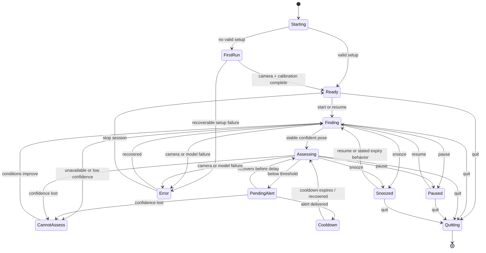
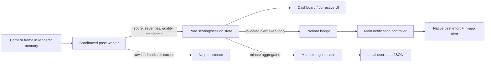

# Open Posture - Complete Product Requirements and Test Specification

- Status: Implemented v0.1.0 baseline; external release evidence remains tracked
- Project model: Fully open-source, source-available, local-first, community maintained, with controlled direct macOS distribution
- Target platforms: macOS, Windows, Linux

## 1. Document purpose

This document defines the complete requirements baseline for an open-source desktop posture coach that contributors can clone, build, and run locally and macOS users can install from a controlled DMG. It covers product behavior, user flows, posture analysis, notifications, corrective feedback, privacy, accessibility, cross-platform operation, source setup, macOS installation, repository maintenance, and verification.

Requirement keywords follow RFC-style meanings:

- **MUST**: required for the relevant release.
- **SHOULD**: expected unless a documented technical reason prevents it.
- **MAY**: optional.

This baseline contains 18 P0 features, 12 P1 features, 34 end-to-end/user/contributor flows, and 233 detailed test cases. It synthesizes five specialist passes: product/UX, architecture and source installation, posture intelligence, verification, and open-source maintenance.

Recommended stack: Electron 43.x + direct Webpack/TypeScript builds + plain HTML/CSS/TypeScript + one runtime dependency, `@mediapipe/tasks-vision` with a locally bundled Pose Landmarker Lite model. Node 24/npm 11 are the source prerequisites. Electron Forge and its DMG maker are development-only macOS distribution tools. No React, state framework, development server, SQLite, native Node production module, backend, updater, App Store tooling, or automatic publisher is required.

## 2. Product definition

### 2.1 One-sentence promise

The application uses a local webcam and on-device pose estimation to help a person notice sustained posture changes while working, without uploading or storing camera images.

### 2.2 Goals

- G-001: Give users useful, low-noise feedback about sustained posture changes.
- G-002: Keep camera processing and posture data local and inspectable.
- G-003: Allow a contributor to clone and run the project with a short, documented setup.
- G-004: Behave consistently enough across macOS, Windows, and common Linux desktops.
- G-005: Be approachable to contributors and sustainable for a small maintainer team.
- G-006: Let a technical first-time user reach a calibrated monitoring session within 10 minutes, excluding downloads.
- G-007: Give every visible failure a specific recovery or safe exit and keep false-alert volume low enough that Balanced mode remains useful all day.

### 2.3 Non-goals

- NG-001: The project is not a medical device and does not diagnose, treat, prevent, or cure a condition.
- NG-002: The project does not define one universally correct posture.
- NG-003: The project does not provide accounts, payments, license keys, telemetry, advertising, cloud synchronization, or a hosted service.
- NG-004: The maintainers never distribute unsigned/ad-hoc artifacts as public production downloads and do not ship App Store, Windows, or Linux installers in the initial scope.
- NG-005: The project does not identify people, record video, recognize faces, or infer sensitive attributes.
- NG-006: The project does not include competitive leaderboards or social scoring.

### 2.4 Alert-delivery and distribution-trust limitation

Reliable background native notifications cannot be guaranteed on every OS or in every distribution state. Unsigned source/local macOS builds have weaker application identity, Windows source toasts may depend on installed identity, and Linux depends on the desktop notification service. Even a signed/notarized macOS app remains subject to notification permission, Do Not Disturb, and OS suppression. The app therefore owns a non-focus-stealing in-app alert window and tray/window state as its consistent fallback.

Even that fallback cannot guarantee the person notices it when another application is full-screen or the OS/window manager suppresses it. The product MUST describe alert capability honestly and MUST NOT claim guaranteed delivery. Signing/notarization improves macOS trust and application identity, not delivery certainty.

## 3. Release scope

### 3.1 MVP

The MVP is the smallest release that satisfies the promise. Every P0 item is release-blocking.

| ID | P0 feature | Acceptance summary |
|---|---|---|
| FEAT-001 | Setup and distribution | One documented clone → `npm ci` → verify → `npm start` path plus a no-Node macOS DMG install path; no account, key, or service |
| FEAT-002 | Privacy onboarding | Explain local processing, camera use, stored data, offline boundary, and wellness-only purpose before permission |
| FEAT-003 | Camera permission and selection | Explicit user-triggered permission; enumerate/select video camera; never request audio |
| FEAT-004 | Positioning preview | Mirrored live preview, framing guide, and quality checklist |
| FEAT-005 | Personal calibration | Quality-checked reference capture with cancel/retry and safe replacement |
| FEAT-006 | Local monitoring | On-device landmark inference, normalized features, smoothed similarity, confidence gating, drift and recovery |
| FEAT-007 | Low-noise alerts | Continuous delay, hysteresis, cooldown, notification delivery status, and no alerts while unassessable |
| FEAT-008 | Corrective experience | Non-shaming screen with live recovery, relevant directional comparison, snooze, pause, and recalibrate |
| FEAT-009 | Pause, snooze, and resume | Immediate camera release; visible state; fresh stable window after resume |
| FEAT-010 | Tray/background behavior | Close-to-tray education, stateful controls, single instance, explicit Quit |
| FEAT-011 | Today history | Local monitored/assessed minutes, average similarity, and notified episodes; no raw pose history |
| FEAT-012 | Settings | Camera, three sensitivity presets, delay, cooldown, preview, alerts, history, accessibility, privacy/data |
| FEAT-013 | Data controls | Inspect what is stored; delete history, calibration, or all data locally |
| FEAT-014 | Recovery and diagnostics | Specific camera/model/storage/notification errors; sanitized local diagnostic copy |
| FEAT-015 | Accessibility | Keyboard/screen-reader operation, text + icon states, WCAG AA contrast, zoom, reduced motion |
| FEAT-016 | Offline and security enforcement | Local assets, denied runtime network, sandboxed renderer/worker, narrow validated IPC |
| FEAT-017 | Cross-platform verification | Required CI on macOS, Windows, and Ubuntu plus a physical Windows pre-stable checklist |
| FEAT-018 | Open-source project surface | README demo, license/notices, contributing, security, Code of Conduct, issue/PR templates, roadmap |

### 3.2 P1 follow-up features

| ID | P1 feature | Scope boundary |
|---|---|---|
| FEAT-101 | Day/week history | Aggregate charts and accessible tables only |
| FEAT-102 | Multiple desk profiles | Explicit named profiles; never silently switch |
| FEAT-103 | Guided reset timer | Optional calm 20–30 second reset; reduced-motion alternative |
| FEAT-104 | Break reminders | Separate from posture alerts and off by default |
| FEAT-105 | Schedules/quiet hours | Local only; respect OS Do Not Disturb |
| FEAT-106 | Sound | Optional, previewable, and never the only alert signal |
| FEAT-107 | Export | Aggregate JSON/CSV and redacted diagnostics; no images or landmark streams |
| FEAT-108 | Setup health check | Runtime, model checksum, storage, camera, and notification capability |
| FEAT-109 | Compact window | Small persistent status surface |
| FEAT-110 | Localization/high contrast | Community translations with English fallback and explicit high-contrast mode |
| FEAT-111 | Retention controls | Disable history or select a bounded retention duration |
| FEAT-112 | Camera-movement hint | Suggest framing check/recalibration; never alter the baseline automatically |

### 3.3 P2/community proposals

Alternative local pose models, portable settings, session comparison, global pause shortcut, optional skeleton-only preview, additional camera placement guides, and evidence-based local achievements MAY be proposed only after the P0 privacy and test boundaries are stable.

### 3.4 Explicitly out

Accounts, hosted APIs, sync, telemetry, ads, payments, automatic updates, app stores, Windows/Linux installers, social feeds, leaderboards, medical claims, face/person identification, raw recordings, copied SuperShrimp branding/assets/copy, mobile/browser clients, webhooks, and plugin systems are outside v0.x. A direct macOS DMG is in scope. A future network feature requires a separate public design decision and threat review.

## 4. Personas and use contexts

| ID | Persona | Need |
|---|---|---|
| PER-001 | Privacy-conscious knowledge worker | Gentle reminders without uploading camera footage |
| PER-002 | Developer or technical early adopter | A short clone, install, run, and modify path |
| PER-003 | Remote worker | Reliable behavior at a fixed laptop or desk camera |
| PER-004 | Accessibility-sensitive user | Full operation without depending only on vision, color, sound, or a pointer |
| PER-005 | Contributor | Clear architecture, reproducible fixtures, tests, and small contribution paths |
| PER-006 | Maintainer | A focused repository with no hosted operational burden |

Primary use context: one adult, one computer, one active camera, one seated desk setup, and one locally stored calibration. The person may naturally turn, stretch, drink, stand, or leave the frame. Those ordinary movements are not failures and MUST NOT be labeled as poor posture.

The source path remains intended for technical users willing to install prerequisites. The macOS path targets users who want to drag an app to Applications without Node/npm. Until Developer ID signing/notarization and final-artifact evidence pass, only a local unsigned/ad-hoc installer candidate—not a public production download—is promised.

## 5. System states and conceptual model

### 5.1 Product vocabulary

| Term | Definition |
|---|---|
| Calibration | A short, quality-checked sample of derived pose measurements while the user holds a comfortable personal reference posture. No image is stored. |
| Similarity score | A smoothed 0-100 comparison with the user’s calibration. It is not a health, ergonomic, or universal posture score. |
| Assessable | The selected person and required landmarks have sufficient confidence, framing, and stability to calculate a comparison. |
| Cannot assess | Pose confidence is insufficient, the person is absent/obscured, multiple people are present, or the camera/model is unavailable. This state is neutral. |
| Drift | A confident, smoothed measurement below the configured similarity threshold. |
| Pending alert | Drift has begun but has not remained continuous for the required delay. |
| Episode | A continuous assessable interval that passes the alert threshold and delay. |
| Recovery | Similarity remains above a higher recovery threshold for the required recovery duration. |
| Cooldown | A period following a delivered alert in which another native alert is suppressed. |
| Monitoring time | Wall-clock time in an active session. |
| Assessed time | Only active-session time during which confidence is sufficient. |

All user-facing comparisons MUST include or inherit the meaning “relative to your calibration.” The UI MUST NOT use “perfect posture,” “bad posture,” “wrong posture,” medical claims, shame, or urgency.

### 5.2 Application state machine



Window visibility is independent of monitoring state. Hiding the window MAY keep an active session running in the tray; pausing, snoozing, an unrecoverable error, or quitting MUST stop camera capture.

### 5.3 User-facing states

| Internal state | Required label | Camera | Alert timer |
|---|---|---:|---:|
| Ready | Ready to monitor | Off | Reset |
| Finding | Finding you… | On | Reset |
| Assessing, above threshold | Looking good | On | Reset |
| Assessing, below threshold | Posture is changing | On | Running |
| Alert condition | Time to reset | On | Completed |
| Cannot assess | Specific neutral guidance, such as “Move into camera view” | On or unavailable | Reset |
| Cooldown | Monitoring · next alert eligible in … | On | Suppressed |
| Paused | Monitoring paused | Off | Reset |
| Snoozed | Snoozed · resumes in … | Off | Reset |
| Recoverable error | Specific cause and recovery action | Off if capture affected | Reset |

### 5.4 Fixed MVP decisions

- One local user, camera, and calibration.
- Source remains canonical and cross-platform; local macOS DMG packaging is supported, while a public DMG requires Developer ID signing/notarization and exact-artifact evidence.
- No backend, account, runtime network request, auto-updater, analytics, or crash upload.
- No persistence of camera frames or raw pose-landmark sequences.
- Native alerts never steal focus. Clicking one opens the corrective screen.
- An accessible in-app alert window/banner is mandatory when native notifications cannot be delivered.
- Pause and snooze stop the camera.
- Cannot assess never advances drift, creates an episode, or lowers history averages.
- History is aggregate and explanatory, not competitive.
- New branding, copy, design, code, and demo assets MUST be independently created.

## 6. Functional requirements

### 6.1 Source setup, macOS installation, and launch

#### Supported lifecycle

- **INST-001 (P0):** Two lifecycles are supported: cross-platform source setup is clone → install locked dependencies → verify model → `npm start`; macOS direct installation is obtain an architecture-matching DMG → drag Open Posture to Applications → launch. Installed users need no Node/npm.
- **INST-002 (P0):** The canonical source commands are:

```bash
git clone <repository-url>
cd <repository-directory>
node --version
npm --version
npm ci
npm run model:verify
npm start
```

- **INST-003 (P0):** Source setup and packaging require Node.js 24.11 or newer within the Node 24 LTS line and npm 11. Declare `engines.node: ">=24.11 <25"`, exact verified versions in `packageManager`, `.nvmrc`, and `.node-version`, and fail early with a friendly version message. Installed macOS users require neither.
- **INST-004 (P0):** Commit `package-lock.json`; support npm only; source runs and local unsigned/ad-hoc packaging require no API key, environment variable, global package, Xcode, Rust, Python, compiler, database, Docker, or hosted dependency. Public signing/notarization credentials exist only in a protected release environment.
- **INST-005 (P0):** `git clone`, `npm ci`, the explicit Electron installer run by the first `npm start`, and downloading a published DMG require internet access. After dependencies/assets are present or the app is installed, normal app runtime MUST be offline.
- **INST-006 (P0):** No generated application or DMG is committed to Git. A public release MAY attach only final Developer ID signed/notarized/stapled arm64/x64 DMGs and a verified checksum manifest. Electron and the pinned MediaPipe `.task` model remain binary dependencies/assets.
- **INST-007 (P0):** The README MUST distinguish modes: a source run creates no installed entry; the macOS DMG adds an Applications app but no login item, privileged helper, automatic updater, standalone uninstaller, or App Store identity. Local unsigned/ad-hoc artifacts MUST NOT be described as public production downloads.
- **INST-008 (P0):** A second launch MUST focus/show the existing process and MUST NOT create a second camera session.
- **INST-009 (P0):** First launch loads local assets but remains camera-off until the user finishes the privacy explanation and selects **Allow camera**.
- **INST-010 (P0):** Later launches load the last safe configuration into Ready/Paused; camera activation still requires **Start monitoring**. An opt-in auto-start feature is deferred.

#### Required scripts

| Script | Contract |
|---|---|
| `npm start` | Verify/download the pinned Electron runtime, production Webpack build, then direct Electron source run |
| `npm run build` | Production-mode compilation only; no application package |
| `npm run typecheck` | `tsc --noEmit` |
| `npm test` | Deterministic unit/integration suite without Electron or a real camera |
| `npm run test:smoke` | Electron fake-camera smoke suite |
| `npm run model:verify` | Verify the committed model against its pinned SHA-256 |
| `npm run check` | Typecheck + tests + build + model verification |
| `npm run debug` | Source run with local Electron diagnostics enabled |
| `npm run make:mac` | On macOS, build an unsigned/ad-hoc host-architecture DMG for local testing |
| `npm run make:mac:arm64` / `make:mac:x64` | On macOS, build the named architecture DMG; public release still requires protected signing/notarization gates |

- **INST-011 (P0):** Expose only the minimal macOS Forge package/make scripts. Do not add an automatic publisher, updater, App Store maker, or Windows/Linux maker in v0.x.
- **INST-012 (P0):** Cross-platform source scripts MUST be shell-independent and run unchanged from macOS/Linux shells and Windows PowerShell/CMD. macOS package/make scripts are explicitly macOS-only and MUST fail clearly elsewhere.
- **INST-013 (P0):** README paths MUST distinguish “run the app” (`npm start`) from “contribute” (`npm run check` before a PR).

#### Platform prerequisites and recovery

- **INST-014 (P0):** macOS source setup requires Git and Node 24; an installed DMG does not. Camera-denial instructions point to **System Settings → Privacy & Security → Camera** and distinguish Open Posture installed identity from Electron/terminal source identity.
- **INST-015 (P0):** Windows requires Git for Windows, architecture-matching Node 24, and PowerShell or CMD. Do not recommend WSL for a desktop/camera run.
- **INST-016 (P0):** Windows camera-denial instructions point to **Settings → Privacy & security → Camera** and desktop-app camera access.
- **INST-017 (P0):** Linux requires Git, Node 24, a graphical desktop, a working video device, Electron/Chromium runtime libraries, and a notification daemon only for native alerts. Distro-specific package examples MUST be labeled examples, not universal commands.
- **INST-018 (P0):** Linux recovery may ask the user to validate `/dev/video*` and access using another local camera app. Documentation MUST NOT recommend `--no-sandbox`.
- **INST-019 (P0):** Troubleshooting covers wrong Node version, npm/Electron download failure, model checksum failure, blank window, camera denial/busy/absent, no pose, unavailable notification/tray, and GPU/WASM fallback.

#### Architecture baseline

- **ARCH-001 (P0):** Use Electron 43.x pinned to an exact patched version, direct Webpack/TypeScript builds, plain HTML/CSS/TypeScript, `@mediapipe/tasks-vision`, and development-only Electron Forge/DMG maker for macOS distribution. Do not add React, a state library, a development server, SQLite, native Node modules, an updater, a backend, automatic publisher, App Store maker, or Windows/Linux maker.
- **ARCH-002 (P0):** Use four boundaries: privileged main process; narrow preload bridge; sandboxed renderer; Web Worker for pose inference.
- **ARCH-003 (P0):** Every window uses `nodeIntegration: false`, `contextIsolation: true`, `sandbox: true`, and `webSecurity: true`; call `app.enableSandbox()` before `ready`.
- **ARCH-004 (P0):** Monitoring windows use `backgroundThrottling: false` so hiding the UI does not suspend assessment.
- **ARCH-005 (P0):** The renderer and worker have no Node/filesystem access. The preload exposes named, typed operations only; never expose Electron objects, arbitrary IPC, paths, or arbitrary `openExternal`.
- **ARCH-006 (P0):** Main-process IPC validates sender origin/frame, allowed keys, primitive types, ranges, and state preconditions. Main constructs notification copy; renderer cannot inject it.
- **ARCH-007 (P0):** Deny navigation/new-window requests, `<webview>`, unapproved downloads, and unrecognized permissions.
- **ARCH-008 (P0):** Transfer `ImageBitmap` to the worker, close it after inference, allow at most one inference in flight, and drop rather than queue samples while busy.
- **ARCH-009 (P0):** Core calibration, scoring, smoothing, episode, history, and retention logic are pure TypeScript modules without Electron dependencies.
- **ARCH-010 (P0):** Pin the exact Pose Landmarker Lite revision and SHA-256. Prefer committing the small model directly without Git LFS so a verified clone runs offline.
- **ARCH-011 (P0):** Store third-party version, source URL, checksum, copyright, and license in `THIRD_PARTY_NOTICES.md` and preserve required Apache-2.0 notices.
- **ARCH-012 (P0):** All UI, WASM, model, font, and icon assets are local; no CDN, remote font, or remote model URL is used at runtime.

Recommended source layout:

```text
.github/ISSUE_TEMPLATE/       .github/workflows/
assets/icons/                 assets/models/
docs/                         tests/fixtures/
src/main/                     src/preload/
src/renderer/                 src/renderer/posture/
src/renderer/workers/         tests/
webpack.build.config.js       webpack.rules.js
package.json                  package-lock.json
README.md                     CONTRIBUTING.md
LICENSE                       NOTICE
SECURITY.md                   CODE_OF_CONDUCT.md
THIRD_PARTY_NOTICES.md        CHANGELOG.md
```

### 6.2 First-run onboarding and consent

- **ONB-001 (P0):** Use the ordered steps **Privacy → Camera → Position → Calibrate → Notifications → Ready**, with one task per screen, a visible step indicator, Back, and safe Exit setup.
- **ONB-002 (P0):** Before camera permission, state: what the app does; local frame processing; no recording; exactly what derived data is stored; no runtime networking; deletion controls; and wellness-not-medical status.
- **ONB-003 (P0):** The OS camera dialog occurs only after a user action labeled **Allow camera**. No frame acquisition, enumeration solely for labels, or hidden monitoring occurs earlier.
- **ONB-004 (P0):** **Not now** enters an idle setup-incomplete dashboard. The app MUST NOT trap, nag, or repeatedly re-request permission.
- **ONB-005 (P0):** Camera and notification permissions are explained and requested separately.
- **ONB-006 (P0):** Notification setup is skippable; camera and valid calibration are required only to start monitoring, not to open Privacy, Settings, About, or diagnostics.
- **ONB-007 (P0):** Back/cancel MUST preserve previously completed safe state and MUST NOT overwrite a valid calibration.
- **ONB-008 (P0):** The Ready screen summarizes active camera, calibration timestamp, sensitivity, local privacy, and a primary **Start monitoring** action.

### 6.3 Camera acquisition and preview

- **CAM-001 (P0):** Request video only with ideal 640×480, ideal 15 FPS, maximum 30 FPS, and `audio: false`.
- **CAM-002 (P0):** Electron permission handlers allow only application-origin video media; deny audio, display capture, geolocation, USB, HID, serial, MIDI, clipboard-read, and unknown permissions.
- **CAM-003 (P0):** After permission, enumerate cameras, select a default, let the user switch, and persist only the selected device ID.
- **CAM-004 (P0):** Preview is mirrored by default for user comprehension; scoring uses consistent unmirrored/normalized coordinates and is unaffected by display mirroring.
- **CAM-005 (P0):** Positioning shows a head/shoulder/upper-torso guide and textual quality checks: one primary person, required landmarks visible, sufficient scale, confidence, light, and stability.
- **CAM-006 (P0):** Do not require full-body visibility when the engine uses upper-body features. Do not infer identity, age, gender, emotion, ethnicity, disability, pain, or health.
- **CAM-007 (P0):** More than one sufficiently visible pose yields **Only one person should be in frame** and Cannot assess. The app never identifies or asks the user to select a person.
- **CAM-008 (P0):** Classify failures as permission denied, no device, busy/unreadable, disconnected/track ended, unsupported constraint, or unknown; show a specific recovery action.
- **CAM-009 (P0):** Preview visibility and camera activity are independent. Hiding preview does not stop monitoring; Pause/Snooze/Quit always stop every `MediaStreamTrack`.
- **CAM-010 (P0):** Camera-active, positioning, calibrating, monitoring, paused, and camera-error states are visible as text/icon in the main UI and tray tooltip/menu where available.
- **CAM-011 (P0):** Camera loss cancels pending alerts, stops assessed time, enters a neutral/error state, and never creates history drift.
- **CAM-012 (P0):** Reconnection or resume requires a stable confidence window before scoring and at least the configured alert delay before an alert.
- **CAM-013 (P0):** Changing camera pauses monitoring and requires positioning/recalibration before comparing. The prior camera/calibration remain usable if the change is canceled or new calibration fails.

### 6.4 Calibration

- **CAL-001 (P0):** Introduce calibration as: **Sit in a comfortable posture you want to use as your reference. This is a personal comparison, not a medical standard.**
- **CAL-002 (P0):** Enable calibration only when CAMERA positioning minimums pass. Provide a cancelable/restartable 3-second countdown and an approximately 10-second sampling window.
- **CAL-003 (P0):** Require stable confident samples across the window; reject samples with missing required landmarks, excessive movement, multiple people, camera loss, or insufficient valid-sample ratio.
- **CAL-004 (P0):** Normalize features for frame scale/translation and camera geometry before aggregation; store robust central estimates and variability bounds, not a single frame.
- **CAL-005 (P0):** Calibration MUST NOT store images, video, audio, screenshots, facial crops/templates, or a time series of raw landmarks.
- **CAL-006 (P0):** Success displays **Calibration ready**, camera/device context, timestamp, and a Recalibrate path. New data replaces old data only after complete validation and explicit confirmation.
- **CAL-007 (P0):** Cancel/failure discards partial samples and preserves the prior valid baseline. Retry begins at positioning/calibration, not the start of onboarding.
- **CAL-008 (P0):** Failure messages identify the cause and one corrective action: move into frame, show both shoulders/head, improve light, keep still, remove other people, reconnect/select camera, or retry model.
- **CAL-009 (P0):** Stored calibration metadata includes schema/model version, created-at time, selected device ID/hash as necessary, normalized feature reference, feature dispersion, and quality summary only.
- **CAL-010 (P0):** A model or feature-schema change invalidates incompatible calibration explicitly and guides recalibration; it never silently reinterprets old values.
- **CAL-011 (P1):** Persistent startup drift or changed framing MAY suggest **Did your camera move?** with Check framing/Recalibrate/Dismiss, but MUST NOT auto-change the baseline.

### 6.5 Posture inference and scoring

#### Model and sampling contract

| Setting | Exact MVP value |
|---|---|
| Model | Locally bundled, checksum-pinned MediaPipe Pose Landmarker Lite |
| Mode | `VIDEO`; segmentation masks off |
| Poses requested | 2, solely to detect a second qualifying person |
| Detection/presence/tracking confidence | 0.5 / 0.5 / 0.5 (developer constant) |
| Normal inference | 5 FPS; adaptive 5 → 3 → 2 FPS |
| Away inference | 1 FPS after 30 seconds away |
| Required point floor | Visibility and presence ≥0.55; required-point mean ≥0.70 |
| EMA time constant | 2 seconds, elapsed-time based |
| Calibration | 10 seconds, at least 35 valid samples, at most 60 elapsed seconds |
| Balanced policy | Score <65 for 15 valid seconds; 10-minute cooldown |
| Recovery | Score ≥75 for 3 valid seconds |

- **ML-001 (P0):** Version 0.x supports one seated person in a front or three-quarter view. Nose, both shoulders, and a bilateral head anchor are required; hips improve torso cues but are optional.
- **ML-002 (P0):** Side profile, reclining, standing/walking, extreme high/low camera angles, or major chair/body obstruction are unsupported. Report Cannot assess/positioning help, not a low score.
- **ML-003 (P0):** A qualifying pose requires nose landmark 0 and shoulders 11/12 at visibility and presence ≥0.55, mean required-point quality ≥0.70, plus both ears 7/8 or outer eyes 2/5 at ≥0.55.
- **ML-004 (P0):** Normalized shoulder width MUST be 0.12–0.65. Shoulder midpoint MUST be within normalized x 0.15–0.85 and y 0.20–0.85. Outside yields Move closer/farther/center guidance and no score.
- **ML-005 (P0):** Hips 23/24 are used only when both pass the 0.55 floor. Missing hips removes torso features but retains valid head/shoulder scoring.
- **ML-006 (P0):** Two qualifying poses for three consecutive samples or at least one second enters Multiple people. A small/background detection failing the qualification/framing gate does not block the foreground user.
- **ML-007 (P0):** No qualifying pose for 2 seconds enters Away, resets dwell, and excludes the interval from assessed statistics. Three valid samples spanning at least 2 seconds are required on return.
- **ML-008 (P0):** An invalid interval under 2 seconds freezes EMA/dwell without adding drift time. At 2 seconds, reset dwell and enter the applicable neutral quality state.
- **ML-009 (P0):** Optional luma hints sampled at most every 2 seconds MAY say Add more light below mean 35, Reduce backlighting above mean 225, or Improve contrast when p95−p5 <30. Landmark quality remains authoritative; luma alone never creates drift.
- **ML-010 (P0):** Use monotonic `performance.now()` elapsed time. Scoring, calibration, dwell, cooldown, and recovery MUST NOT depend on delivered frame count or wall-clock changes.
- **ML-011 (P0):** When rolling 30-second p95 inference exceeds 180 ms, reduce sampling 5→3→2 FPS. Increase one step only after p95 is below 120 ms for 60 seconds.
- **ML-012 (P0):** If a selected camera vanishes, block alerts and bind a valid calibration to the new selection. A median shoulder-scale change over 35% for 30 valid seconds pauses alerts and recommends recalibration.
- **ML-013 (P0):** Restart a crashed worker once with all pending state cleared. A second crash in the same session stops monitoring and exposes sanitized diagnostics.
- **ML-014 (P0):** Do not add OpenCV, a blur subsystem, identity tracking, or another vision model in the MVP.

#### Personalized features

For each feature, calibration stores the median and robust dispersion `sigma = 1.4826 × median(abs(sample − median))`. Let `S` be shoulder midpoint, `H` the calibrated anchor type’s midpoint, `P` the optional hip midpoint, `w2` 2D shoulder distance, and `w3` world-coordinate shoulder distance.

| Feature | Normalized value | Drift deviation | Dead-zone floor | Severe range |
|---|---|---|---:|---:|
| Head height | `(S.y - H.y) / w2` | `max(0, baseline - value)` | 0.08 | 0.30 |
| Head forward | `(S.world.z - H.world.z) / w3` | `max(0, value - baseline)` | 0.10 | 0.40 |
| Head lateral | `(H.x - S.x) / w2` | `abs(value - baseline)` | 0.08 | 0.25 |
| Shoulder tilt | `(rightShoulder.y - leftShoulder.y) / w2` | `abs(value - baseline)` | 0.06 | 0.20 |
| Torso height, optional | `(P.y - S.y) / w2` | `max(0, baseline - value)` | 0.10 | 0.35 |
| Torso forward, optional | `(P.world.z - S.world.z) / w3` | `max(0, value - baseline)` | 0.10 | 0.35 |

- **ML-015 (P0):** `deadZone = max(floor, 3 × sigma)` and `severity = clamp((deviation − deadZone) / severeRange, 0, 1)`.
- **ML-016 (P0):** `rawScore = round(100 × (1 − max(available severities)))`. The worst normalized deviation drives the score and primary cue. Do not introduce opaque learned weights in v0.x.
- **ML-017 (P0):** Head height, head forward, head lateral, and shoulder tilt are core. If head height or head forward is unavailable, or fewer than three core features are present, output Cannot assess and no score.
- **ML-018 (P0):** Prefer ear midpoint as head anchor; use outer-eye midpoint only when that anchor type was calibrated. Never switch anchor type within a scored baseline.
- **ML-019 (P0):** Smooth with `alpha = 1 − exp(−dt / 2 seconds)` and `EMA = alpha × raw + (1 − alpha) × previous`. Reset EMA to the first valid raw score after calibration/camera change or ≥2 seconds invalid.
- **ML-020 (P0):** Worker output contains timestamp, integer smoothed score, feature severities, primary correction key, quality state, coverage, and derived recovery dwell only. Raw landmarks/world coordinates and frame-level raw score are released after feature extraction.
- **ML-021 (P0):** For severity ties within 0.02, deterministic cue priority is head forward, head height, torso forward, torso height, head lateral, shoulder tilt.
- **ML-022 (P0):** Given the same ordered feature/timestamp/settings stream, score, cue, and alert-state output is deterministic across supported OSs.

#### Dwell and cue behavior

- **ML-023 (P0):** In Balanced mode, EMA <65 increments bad dwell; 65–69 decrements it by elapsed valid time; ≥70 resets it. Alert when accumulated valid dwell reaches 15 seconds.
- **ML-024 (P0):** After alert, suppress for 10 minutes. When cooldown ends, reset dwell and require a fresh complete dwell even if similarity remained low.
- **ML-025 (P0):** Recovery requires EMA ≥75 for 3 valid seconds. The correction screen then says **Back near your reference** / **Reset detected**.
- **ML-026 (P0):** Primary cue mapping is fixed and conditional: head height → raise head slightly; head forward → ease head back; head lateral → re-center over shoulders; shoulder tilt → relax toward reference; torso height → sit a little taller; torso forward → bring torso back. Prefix movement guidance with **If comfortable**.
- **ML-027 (P0):** No invalid/away/multiple-person/camera/model/sleep/pause interval can increment dwell, lower an average, or trigger an alert.

### 6.6 Monitoring session controls

- **MON-001 (P0):** **Start monitoring** activates camera/model, enters **Finding you…**, and begins monitored time. Assessed time begins only after the stable confidence gate passes.
- **MON-002 (P0):** Dashboard shows status text/icon, score or Cannot assess, monitored and assessed duration, active camera, alert/cooldown status, preview control, Pause/Snooze, Recalibrate, and today summary.
- **MON-003 (P0):** **Pause** is available from dashboard, corrective screen, and tray. It stops camera tracks/inference immediately and resets pending-alert state.
- **MON-004 (P0):** **Resume** reacquires camera/model and returns through Finding. It requires 15 seconds of new confident monitoring before the first eligible alert.
- **MON-005 (P0):** **Snooze** offers 5, 15, 30, and 60 minutes; stops camera/inference; shows exact remaining time; and permits early resume.
- **MON-006 (P0):** A snooze initiated during an active session automatically attempts to resume at expiry. This behavior MUST be stated in the menu. If the system slept, locked, lost permission, or lacks a camera, remain paused and ask the user to resume.
- **MON-007 (P0):** Wall-clock changes and sleep/wake MUST NOT create expiry or alert bursts. Use monotonic elapsed time while awake and reset alert eligibility after wake.
- **MON-008 (P0):** On system suspend or lock, release camera and enter Paused. Do not silently reactivate it on unlock; the user resumes explicitly.
- **MON-009 (P0):** Quit discards timers, stops all tracks, terminates/idles the worker, atomically flushes safe aggregates if possible, and exits without helper processes retaining the camera.
- **MON-010 (P0):** Hide preview affects display only. All camera-active states retain a visible indicator outside the preview.

### 6.7 Alerts and native notifications

- **ALT-001 (P0):** An alert becomes eligible only after confident similarity stays continuously below the selected threshold for its complete delay.
- **ALT-002 (P0):** Balanced defaults are score below 65 for 15 valid seconds, recovery at or above 75 for 3 valid seconds, and 10-minute cooldown. Gentle is below 55/30 seconds/15 minutes; Strict is below 75/8 seconds/5 minutes. These are transparent wellness defaults, not medical thresholds.
- **ALT-003 (P0):** Recovery before delay, confidence loss, pause, snooze, camera/model failure, calibration start, or settings invalidation cancels the pending alert.
- **ALT-004 (P0):** One episode emits at most one alert. Remaining below threshold cannot repeat until both cooldown policy and episode/recovery policy permit a new episode.
- **ALT-005 (P0):** Native alert title: **Posture check**. Body: **You’ve moved away from your calibrated posture. Take a moment to reset.** No image, score, shame, urgency, or sensitive detail appears on the lock screen.
- **ALT-006 (P0):** A notification test uses: **Notifications are ready. We’ll only alert after a sustained change from your calibration.** It does not alter history, cooldown, or episode counts.
- **ALT-007 (P0):** Main process constructs native alerts from a fixed allowlist; renderer sends only a validated event type and opaque current episode ID.
- **ALT-008 (P0):** Native notifications are best effort in every distribution mode. macOS source/local unsigned builds have weaker identity; signed/notarized builds still depend on permission and Do Not Disturb. Windows source runs may lack installed app identity; Linux may lack a compatible daemon.
- **ALT-009 (P0):** The guaranteed cross-platform delivery surface is a compact in-app alert window/banner. It MUST be visible without taking keyboard focus; clicking it opens/focuses the full corrective screen.
- **ALT-010 (P0):** If native delivery reports unavailable/failure, do not mark it delivered. Show the in-app surface and update tray state. If native delivery is merely suppressed by OS Do Not Disturb and cannot be observed, respect it and do not attempt a bypass.
- **ALT-011 (P0):** Clicking a current notification opens the corresponding correction state. Clicking a stale notification after recovery/quit opens the app and says the episode is no longer active; it MUST NOT make a stale corrective claim.
- **ALT-012 (P0):** Do not use critical urgency, persistent OS alerts, action buttons as a cross-platform dependency, focus stealing, flashing, repeated sounds, or rapid retries.

### 6.8 Corrective feedback screen

- **FDB-001 (P0):** Screen title is **Let’s reset** and primary guidance is **Return to the comfortable position you calibrated.** Always frame feedback as a comparison with that reference.
- **FDB-002 (P0):** Show current live state, recovery progress, optional preview/skeleton, and only direction-specific observations whose required landmarks meet confidence criteria.
- **FDB-003 (P0):** Permitted examples include **Your head is farther forward than during calibration** and **Your upper body is leaning to one side**. When evidence is insufficient, show framing guidance rather than a posture claim.
- **FDB-004 (P0):** Controls: **I’ve adjusted**, **Snooze**, **Pause monitoring**, **Recalibrate**, and **Back to dashboard**. Dismissal returns without stopping monitoring unless the user chose Pause/Snooze.
- **FDB-005 (P0):** **I’ve adjusted** does not assert success; it returns to live assessment. After the recovery condition holds, show **Reset detected**.
- **FDB-006 (P0):** The screen works with preview hidden and has complete text/status equivalents. No full-screen takeover, modal trap, alarming red wash, forced countdown, or focus theft.
- **FDB-007 (P0):** Guidance does not prescribe painful movement. Include a low-prominence statement: stop if uncomfortable and seek qualified professional advice for pain or health concerns.
- **FDB-008 (P0):** Directional feedback is limited to validated engine dimensions. Do not invent ergonomic instructions from weak or unavailable signals.

### 6.9 Tray and background behavior

- **TRAY-001 (P0):** Main process owns exactly one Tray object for app lifetime. Its menu includes current state (disabled text), Open, Start/Pause, Snooze submenu, Recalibrate, and Quit.
- **TRAY-002 (P0):** First window close during an active session explains **Monitoring continues in the tray** and identifies Pause and Quit. Later closes hide without repeating the lesson.
- **TRAY-003 (P0):** Tray icon click opens/focuses dashboard; native notification click opens/focuses correction. Close hides; tray/platform Quit exits.
- **TRAY-004 (P0):** Tray tooltip/menu state uses text/icon, not color alone, and updates after every lifecycle transition. Re-apply the Linux context menu when state changes.
- **TRAY-005 (P0):** Use platform-appropriate original assets: macOS 16×16 template + `@2x`, Windows ICO, and Linux PNG.
- **TRAY-006 (P0):** If a reliable tray is unavailable, keep a visible window and make Close equal Quit after an explanatory prompt; never create an invisible unstoppable process.
- **TRAY-007 (P0):** On macOS, standard app Quit and tray Quit terminate monitoring. On Windows/Linux, tray Quit and window-menu Quit do the same.

### 6.10 History and progress

- **HIST-001 (P0):** Today view shows monitored duration, confidently assessed duration, average assessed similarity, number of episodes notified, and minute-or-coarser aggregate timeline.
- **HIST-002 (P0):** Cannot assess time is excluded from average and drift calculations. Monitoring time and assessed time are labeled separately.
- **HIST-003 (P0):** Score help states 100 means closest to the saved calibration, not healthiest or perfect.
- **HIST-004 (P0):** Empty state explains that active, assessable monitoring creates local aggregates.
- **HIST-005 (P0):** Charts use text/icons/patterns in addition to color and expose an equivalent summary/table.
- **HIST-006 (P0):** History avoids streaks, leaderboards, grades, shame, or competitive language.
- **HIST-007 (P0):** Store only per-minute or coarser aggregates and per-episode timestamps/outcomes needed for the UI. Never persist raw frames, landmark streams, or frame-level scores.
- **HIST-008 (P0):** Default retention is 30 days and bounded. User can select Off, 7, 30, or 90 days; “forever” is deferred until storage behavior has long-run validation. History-off does not disable monitoring.
- **HIST-009 (P0):** History write failure shows a persistent accurate warning; monitoring MAY continue, but the UI MUST NOT claim unsaved data was retained.

### 6.11 Settings

| Section | P0 controls/content |
|---|---|
| General | Close-to-tray explanation; no login/startup option in v0.x |
| Monitoring | Gentle/Balanced/Strict; exact threshold/delay/cooldown help; Restore defaults |
| Alerts | Cooldown; native capability/status; Send test; in-app fallback explanation |
| Camera & calibration | Device; preview; framing check; last calibration; Recalibrate |
| Privacy & data | Local-file inventory; runtime-offline statement; history enabled; Delete history/calibration/all |
| Accessibility | Reduced motion override; larger status text if needed; preview-independent behavior |
| About | Version + development commit; license; source; notices; security/contribution links; wellness disclaimer |

- **SET-001 (P0):** Validate every value at the privileged storage boundary. Reject unknown keys, wrong types, NaN/infinities, and out-of-range thresholds/durations.
- **SET-002 (P0):** Immediate-effect settings say so. Camera changes, calibration deletion, and incompatible algorithm changes require confirmation and pause monitoring.
- **SET-003 (P0):** Restore defaults works per section and lists the values that will change.
- **SET-004 (P0):** A malformed settings file is quarantined/backed up, safe defaults load, and the UI identifies which values were reset.
- **SET-005 (P0):** External documentation/source links open only after explicit user activation, are visibly external, and are checked against an allowlist.
- **SET-006 (P0):** Start at login and automatic camera start remain out of v0.x in every distribution mode because explicit user-controlled camera activation is a trust boundary.

### 6.12 Diagnostics and recovery

| ID | Failure | Required behavior |
|---|---|---|
| ERR-001 | Unsupported Node/dependency | Fail before app start with exact supported version and docs path |
| ERR-002 | Model missing/checksum/corrupt | Block monitoring; identify model verification/reinstall action |
| ERR-003 | Worker/model crash | Stop assessment; retry once safely; then Restart engine/Copy diagnostics |
| ERR-004 | Permission denied | Explain OS path; Check again; Continue without setup |
| ERR-005 | No camera | Refresh; Settings/Privacy/About remain usable |
| ERR-006 | Camera busy/unreadable | Ask to close other camera apps; Retry/Choose camera |
| ERR-007 | Track disconnected | Cancel alerts; stop assessed time; Retry/Choose/Pause |
| ERR-008 | Multiple people | Neutral Cannot assess; ask for one person; never identify/select |
| ERR-009 | Low visibility/light | Concrete framing/light suggestion; no posture claim |
| ERR-010 | Native notification unavailable | Explain limitation; demonstrate in-app alert; link OS settings where useful |
| ERR-011 | OS Do Not Disturb | Never claim delivery or bypass; explain possible suppression |
| ERR-012 | Malformed settings/history | Preserve/quarantine bad file; load safe defaults/new store with disclosure |
| ERR-013 | Disk full/write fail | Keep safe functions; persistent warning; never claim saved/deleted success |
| ERR-014 | Migration fail | Preserve original and last-known-good; offer rollback/retry/diagnostics |
| ERR-015 | GPU/WASM unavailable | Supported CPU/WASM fallback or clear limitation; no indefinite hang |
| ERR-016 | Sleep/wake/lock | Release camera; reset pending alert; remain Paused until explicit resume |
| ERR-017 | Resolution/orientation change | Suspend scoring until stable; require/suggest recalibration as appropriate |
| ERR-018 | Second instance | Focus existing process; retain one capture/worker |
| ERR-019 | Tray unavailable | Visible-window fallback; explicit Close/Quit |
| ERR-020 | Stale notification click | Launch/show current state; no stale “you need to reset” claim |

- **DIAG-001 (P0):** Local logs contain lifecycle/state transitions, non-sensitive error codes, model-load time, and aggregate inference timing only.
- **DIAG-002 (P0):** Logs contain no frames, landmark arrays, posture feature vectors, device names/IDs, usernames, home paths, or user-entered content.
- **DIAG-003 (P0):** Cap logs at 5 MB total. **Copy diagnostics** redacts usernames/absolute paths and previews exactly what will be copied.
- **DIAG-004 (P0):** Never upload diagnostics. Issue templates warn users to inspect them before posting.
- **DIAG-005 (P0):** Every error screen names the failed component, preserves any safe prior calibration/data, and provides at least one valid next action or safe exit.

### 6.13 Privacy, security, and data lifecycle

- **PRIV-001 (P0):** All inference occurs locally. Runtime external network requests are zero.
- **PRIV-002 (P0):** Ship local HTML, JS, CSS, icons, fonts, WASM, and model. Production CSP uses `default-src 'none'`, `connect-src 'none'`, self-only script/style/font, blob media/worker as required, and denies object/base/frame ancestors.
- **PRIV-003 (P0):** Centralize one Electron request-blocking listener and cancel all renderer HTTP(S)/WS(S), including loopback. An automated Electron test proves external fetch is rejected.
- **PRIV-004 (P0):** No telemetry, analytics, crash upload, update check, remote configuration, account, sync, newsletter, advertising, or network log. Do not initialize an uploading crash reporter.
- **PRIV-005 (P0):** Frames remain only in renderer/worker memory and never cross IPC, storage, logs, diagnostics, or issue fixtures. Close transferred bitmaps promptly.
- **PRIV-006 (P0):** Persist no image/video/audio/screenshot, facial template, biometric identity, camera label, raw landmark, frame-level feature, or continuous score trace.
- **PRIV-007 (P0):** Store under a dedicated child of Electron `userData`, never in the repository. Files are limited to validated settings/calibration, aggregate history, and capped sanitized logs.
- **PRIV-008 (P0):** JSON writes use schema validation, adjacent temporary file, atomic replacement, and one last-known-good backup. Corrupt input is quarantined.
- **PRIV-009 (P0):** Privacy view lists every file/category, purpose, retention, and deletion effect, including calibration as locally stored body-derived measurements.
- **PRIV-010 (P0):** Delete history preserves calibration/settings; Delete calibration stops monitoring and returns to setup; Reset all returns to first-run. Confirmations name exact consequences and report real success/failure.
- **PRIV-011 (P0):** Data deletion needs no account, network, identity verification, or maintainer service.
- **PRIV-012 (P0):** Pause, snooze, lock/suspend, capture error, and quit release camera. Preview-off is never described as camera-off.
- **PRIV-013 (P0):** All unrecognized permissions, IPC calls, navigation, and external-opening requests fail closed.
- **PRIV-014 (P0):** A privacy regression—external request, stored frame, microphone access, broad IPC, or unsafe diagnostics—is a release-blocking security vulnerability.

### 6.14 Accessibility

- **A11Y-001 (P0):** Every essential control is keyboard reachable/operable with a persistent visible focus indicator and task-consistent focus order.
- **A11Y-002 (P0):** Semantic headings, landmarks, labels, button names, descriptions, and error associations support macOS VoiceOver, Windows Narrator, and Linux Orca where available.
- **A11Y-003 (P0):** Announce monitoring start, pause, Cannot assess, alert, recovery, and errors through a polite status region. Do not announce continuous score updates.
- **A11Y-004 (P0):** Text and UI components meet WCAG 2.2 AA contrast. Status always uses text plus icon/shape; never color or sound alone.
- **A11Y-005 (P0):** Essential UI remains operable at 200% zoom without clipped controls or two-dimensional scrolling for the main task.
- **A11Y-006 (P0):** Respect OS reduced-motion and an app override; disable pulsing rings, decorative countdown animation, and skeleton transitions while preserving progress text.
- **A11Y-007 (P0):** Pointer targets SHOULD be at least 44×44 CSS pixels. Do not require drag, hover, precise timing, or a pointer for setup/correction.
- **A11Y-008 (P0):** Camera guides, preview, overlay, chart, and color-coded trend have text/table equivalents.
- **A11Y-009 (P0):** Errors are announced or receive focus at the error heading without unexpectedly moving focus during normal score changes.
- **A11Y-010 (P0):** Countdown can be canceled/restarted; no setup response is time-limited.
- **A11Y-011 (P0):** Corrective wording is plain, non-shaming, non-medical, and does not assume the user can perform a movement.
- **A11Y-012 (P0):** The in-app fallback alert appears without stealing keyboard focus and exposes an accessible status/action when the user chooses to interact.

### 6.15 Open-source repository and maintenance

- **OSS-001 (P0):** Above the README fold: independent name/logo, one-sentence benefit, real 10–20 second demo, local-runtime explanation, source-supported platforms, prerequisites, and shortest working commands.
- **OSS-002 (P0):** README clearly distinguishes cross-platform source runs, local unsigned/ad-hoc macOS DMGs, and future public signed/notarized DMGs; states no backend/accounts/telemetry/commercial flow; and distinguishes dependency/artifact download from offline runtime.
- **OSS-003 (P0):** Include Apache-2.0 `LICENSE`, `NOTICE`, `THIRD_PARTY_NOTICES.md`, `CONTRIBUTING.md`, `CODE_OF_CONDUCT.md`, `SECURITY.md`, `GOVERNANCE.md`, `ROADMAP.md`, `CHANGELOG.md`, and architecture/algorithm/privacy/testing/troubleshooting/data/model docs.
- **OSS-004 (P0):** Simple maintainer-led governance: maintainers retain scope/merge authority; material privacy, algorithm, dependency, or architecture changes require a public design issue. No committee/RFC bureaucracy initially.
- **OSS-005 (P0):** Protect `main`; require PR, green required checks, resolved threads, and one maintainer approval for non-maintainer changes; default to squash merge.
- **OSS-006 (P0):** No CLA initially. State that contributions are submitted under Apache-2.0.
- **OSS-007 (P0):** Structured bug, feature, performance, and platform issue forms warn against camera recordings, identifiable screenshots, raw landmarks, usernames, and unreviewed diagnostics.
- **OSS-008 (P0):** PR template requests linked issue, summary, tests, platforms, UI evidence, privacy/security/docs/dependency/license impact, and confirmation of no generated artifacts or personal camera data.
- **OSS-009 (P0):** Scoring PRs require deterministic fixtures, user-visible threshold analysis, and preservation of non-medical language. Data PRs require migration and rollback behavior. New dependencies require necessity and license justification.
- **OSS-010 (P0):** Enable private vulnerability reporting. `SECURITY.md` lists supported versions, best-effort acknowledgement/triage targets, coordinated disclosure, and no promised bounty. Privacy regressions are security issues.
- **OSS-011 (P0):** Preserve provenance/license for every runtime dependency, model, WASM item, font, fixture, and asset. No SuperShrimp branding, copy, screenshots, illustrations, icons, source, or reproduced layout assets.
- **OSS-012 (P0):** ROADMAP uses Now/Next/Later/Exploring with explicit non-goals and no fake dates. Use SemVer, source archives for every GitHub release, controlled macOS artifact release rules, changelog categories, and documented migrations.
- **OSS-013 (P0):** Required release gate: CI green, model/license verification, privacy review, current docs, zero unresolved blockers, and recorded manual smoke results for affected platforms.
- **OSS-014 (P0):** CI enables CodeQL and dependency review, pins third-party Actions to full SHAs, grants read-only permissions by default, and exposes no secrets to untrusted forks. Ordinary CI never uploads application builds; only the protected macOS artifact workflow may upload bounded DMG evidence after its gates.
- **OSS-015 (P0):** Dependabot runs weekly with grouped non-major updates. Electron/MediaPipe major updates use separate PRs with full platform/security review.
- **OSS-016 (P0):** `good first issue` means bounded confirmed work with acceptance criteria, likely files, and an available reviewer. Never auto-close useful old issues or use stale/contributor leaderboard bots.
- **OSS-017 (P0):** Growth comes from the working demo, fast clone-to-demo, transparent algorithm/privacy, honest limits/benchmarks, responsive maintenance, and useful starter issues—not bought/exchanged stars, automated follows, vanity counters, badge walls, or in-app star nags.
- **OSS-018 (P0):** One restrained README line below demo/quick start may say: **If this is useful, starring helps others discover it.**

### 6.16 Screen inventory and exact hierarchy

| ID | Screen/surface | Required content and primary actions |
|---|---|---|
| SCR-001 | Welcome/Privacy | Promise; local processing; stored/not-stored list; offline boundary; wellness disclaimer; Continue |
| SCR-002 | Camera permission | Why video is required; Allow camera; Not now; no preview before permission |
| SCR-003 | Position camera | Device picker; mirrored preview; text + guide qualification; Continue/Exit |
| SCR-004 | Calibration | Personal-reference instruction; cancelable countdown; valid-sample progress; reasoned Retry/Choose camera/Exit |
| SCR-005 | Notification test | Native capability; exact test copy; Send test/Skip; fallback demonstration |
| SCR-006 | Ready/Dashboard | State first; score meaning; monitored/assessed time; camera/cooldown; preview; Start/Pause/Snooze/Recalibrate; today summary; local privacy |
| SCR-007 | Passive in-app alert | **Posture check** + neutral body + Open reset/Dismiss; non-activating, text/icon, accessible status |
| SCR-008 | Correction | **Let’s reset**; live relative state; one valid cue; optional skeleton; recovery; Adjusted/Snooze/Pause/Recalibrate/Back |
| SCR-009 | History | Today metrics; aggregate chart + table; score/assessed help; empty/history-off states |
| SCR-010 | Settings | General, Monitoring, Alerts, Camera & calibration, Privacy & data, Accessibility, About |
| SCR-011 | Privacy & data | File/category inventory; retention; Reveal data folder; Delete history/calibration/all with exact confirmation |
| SCR-012 | Recoverable error | Specific title/cause; state impact; primary recovery; secondary settings/diagnostics/pause/quit as applicable |

Dashboard hierarchy MUST remain:

```text
[Camera active · processing locally]                 [Settings]

LOOKING GOOD / POSTURE IS CHANGING / CANNOT ASSESS
82 — relative to your calibration
Plain-language explanation or framing action

[Preview or text-equivalent panel]

[Pause] [Snooze ▾] [Recalibrate]
Monitored 1h 20m · Assessed 1h 07m · Cooldown/eligibility

Today: assessed time · average similarity · notified episodes
```

Passive in-app alert:

```text
Posture check
Your position has drifted from your personal reference.
[Open quick reset]  [Dismiss]
```

Correction hierarchy:

```text
Let’s reset
If comfortable, ease your head back toward your reference.

[Optional baseline/current skeleton — camera image hidden by default]
Live: 61 relative to calibration · recovering…

[I’ve adjusted] [Snooze] [Pause monitoring]
[Recalibrate]   [Back to dashboard]
```

No surface uses a full-screen takeover, flashing, alarming red wash, shame, medical certainty, or an automatic focus grab.

## 7. Complete user flows

### 7.1 Getting the app and first setup

#### FLOW-001 — Discover, install or clone, and launch

1. User sees the real product loop, privacy promise, verified/experimental platforms, distribution trust state, prerequisites, and canonical paths above the README fold.
2. A source user installs Git/Node 24, clones, checks versions, runs `npm ci`, `npm run model:verify`, then `npm start`. A macOS installer user obtains the matching arm64/x64 DMG, verifies its documented trust/checksum state, drags Open Posture to Applications, and launches without Node/npm.
3. The app opens Welcome. Neither path uses an account, key, hosted service, or runtime network dependency.
4. On failure, the console/app names source runtime/dependency/checksum errors or packaged Gatekeeper/architecture/resource errors and links the matching local docs.

Exit: Welcome or an actionable startup error. Acceptance: clean-clone commands work on every claimed CI platform; the macOS DMG works only at its honestly evidenced trust tier; runtime networking is distinguished from dependency/artifact retrieval.

#### FLOW-002 — Understand and consent

1. Welcome explains the personal-reference posture reminder.
2. Privacy states what is processed in memory, what three local data categories may be stored, what is never stored, runtime-offline behavior, deletion, and the wellness boundary.
3. User selects Continue, then **Allow camera** or **Not now**.
4. Not now enters a useful idle dashboard with Privacy/Settings/About and **Finish setup**; it does not prompt again automatically.

Exit: Camera permission flow or idle setup-incomplete state. Acceptance: no camera call occurs before the explicit action.

#### FLOW-003 — Grant camera permission

1. After **Allow camera**, the OS prompt appears.
2. If granted, the app enumerates devices, selects the preferred/default camera, starts a video-only preview, and advances to Position.
3. If no device is returned, it enters FLOW-021.

Exit: Position camera or a specific camera recovery state.

#### FLOW-004 — Deny and later recover camera permission

1. Denial shows **Camera access is off**, the relevant OS settings path, **Check again**, and **Continue without setup**.
2. The user may change permission outside the app.
3. **Check again** re-enumerates/retries once without a prompt loop.
4. Grant advances to Position; continued denial remains safely idle.

Acceptance: denial, absence, and busy camera are not conflated; no scoring/history exists.

#### FLOW-005 — Select and position camera

1. Show device selector, mirrored preview, framing guide, and live textual checks.
2. User selects a camera; preview and qualification update.
3. Continue enables only for exactly one qualifying, centered, adequately scaled, stable pose.
4. Disabled Continue explains the current action: closer/farther/center/light/show head and shoulders/one person.

Exit: Calibration. Alternative: choose another device, retry, or leave setup.

#### FLOW-006 — Calibrate successfully

1. Explain personal-reference meaning and ask for a comfortable position.
2. After a 2-second stable gate, user starts a cancelable 3-second countdown.
3. Collect for 10 seconds, pausing on short invalid frames, until at least 35 valid stable samples exist.
4. Robust validation passes; derived medians/dispersion are prepared.
5. For first setup, save. For recalibration, preview the success and ask to replace the previous baseline.
6. Show **Calibration ready**, timestamp/context, and Continue.

Exit: Notification setup/Ready. Acceptance: no per-frame sample is persisted.

#### FLOW-007 — Calibration fails or is canceled

1. Pause/stop collection on visibility, stability, multiple-person, camera, or engine failure; fail after the specified limit.
2. State the exact cause and one correction.
3. Offer **Try again**, **Choose another camera**, and **Exit setup**.
4. Discard partial samples. Keep the previous calibration, if any, unchanged.

#### FLOW-008 — Configure/test alerts

1. Explain native alerts and the cross-platform in-app fallback.
2. User selects **Send test notification** or **Skip**; any OS permission follows only that action.
3. If native delivery is supported, show fixed test copy. Click opens/focuses the app.
4. If denied/unavailable/failed, demonstrate the non-focus-stealing in-app surface, show degraded capability, and give OS guidance.

Exit: Ready. Acceptance: test changes no score, history, episode, or cooldown.

### 7.2 Daily monitoring and correction

#### FLOW-009 — Start monitoring

1. Ready summarizes selected camera, calibration, preset, alert capability, and local privacy.
2. User selects **Start monitoring**; camera/worker start and status says **Finding you…**.
3. After return/stability gates, display score/status and start assessed time.
4. User may hide preview or close to tray without stopping the session.

#### FLOW-010 — Normal monitoring

1. Dashboard continuously shows state, relative score/explanation, monitored vs assessed time, camera-active indicator, alert eligibility/cooldown, and primary controls.
2. Confident samples update smoothed score and minute aggregate.
3. Ordinary brief motion may freeze/alter score but does not alert unless the complete valid-dwell rule passes.

#### FLOW-011 — Brief drift and recovery before alert

1. Score falls below the preset threshold and enters **Posture is changing**.
2. Valid bad dwell advances; no notification appears yet.
3. Score enters 65–69 (Balanced), so dwell decays, or reaches ≥70, so it resets.
4. No episode/notification is recorded.

#### FLOW-012 — Sustained drift and alert

1. Valid score remains below threshold for the entire policy dwell.
2. Create one episode and request one best-effort native alert.
3. Independently show the guaranteed non-activating in-app alert surface and tray Needs attention state when needed.
4. Enter cooldown; continued drift cannot repeat immediately.
5. Ignore/dismiss leaves monitoring running. Native/in-app click opens FLOW-013.

#### FLOW-013 — Use the corrective screen

1. **Let’s reset** shows score relative to baseline, primary confidence-supported cue, optional skeleton/hidden camera, and live recovery.
2. User moves, chooses **I’ve adjusted**, dismisses/back, snoozes, pauses, or recalibrates.
3. I’ve adjusted/dismiss does not assert success; live assessment continues.
4. At score ≥75 for 3 valid seconds, show **Back near your reference / Reset detected**; return/close after a short readable confirmation unless user keeps it open.
5. If confidence is lost, replace posture cue with framing guidance.

#### FLOW-014 — Pause and resume

1. Pause from dashboard/correction/tray stops every camera track, worker inference, assessed history, and pending dwell.
2. Status and tray say **Monitoring paused**.
3. Resume reacquires camera and passes through Finding/return gate.
4. Require at least 15 new valid seconds before any alert; do not burst after resume.

#### FLOW-015 — Snooze and resume

1. User selects 5/15/30/60 minutes; the control states that an active session will attempt to resume at expiry.
2. Stop camera/inference and display remaining duration.
3. Resume early follows FLOW-014.
4. At expiry while awake/unlocked and permission/device valid, attempt Finding. Otherwise remain Paused and ask to resume.
5. Fresh full dwell is required before an alert.

#### FLOW-016 — Hide to tray and reopen

1. First close in an active session explains background monitoring and Pause/Quit locations.
2. Confirm/hide keeps the active state; later closes hide directly.
3. Tray shows state and Open/Start-or-Pause/Snooze/Recalibrate/Quit.
4. Tray click reopens dashboard. If tray is unsupported, visible-window fallback prevents invisible monitoring.

#### FLOW-017 — Quit

1. User chooses tray/platform Quit.
2. Stop tracks, worker, pending alerts, and timers; atomically flush safe aggregates if possible.
3. Exit all processes. A later source run starts Ready/Paused, never auto-camera.

### 7.3 Camera, confidence, and lifecycle exceptions

#### FLOW-018 — Person absent, obscured, unsupported, or multiple

1. A sub-2-second confidence loss freezes state/dwell without penalty.
2. At 2 seconds, enter specific Cannot assess/Away/Multiple people; reset dwell and assessed time.
3. Show neutral framing/view guidance. Send no posture alert.
4. On return, require three valid samples over at least 2 seconds before scoring.

#### FLOW-019 — Change camera

1. Settings → Camera; selecting a new device pauses/stops the current session.
2. Validate new preview and explain that geometry changed.
3. Run positioning/calibration. Save device/baseline only after successful confirmation.
4. Cancel/failure restores prior device/baseline/session when available.

#### FLOW-020 — Camera moves significantly

1. Shoulder scale differs by more than 35% from calibration for 30 valid seconds.
2. Pause alerts and show **Did your camera move?**
3. Offer Check framing, Recalibrate, or Dismiss/continue without alerts as specified.
4. Never alter calibration automatically. This behavior may ship P1 if validation is not ready.

#### FLOW-021 — Camera absent, busy, denied, or disconnected

1. Classify and display the specific error; stop dwell/assessed time and avoid a posture event.
2. Offer the relevant Refresh/Retry/Choose camera/Open settings/Pause.
3. Unexpected disconnect retries selected camera at 1, 3, and 10 seconds, then waits for manual Retry.
4. Successful recovery passes through Finding/return gate; changed device requires calibration.

#### FLOW-022 — Worker/model failure

1. Missing/checksum-invalid model blocks camera startup with verify/reinstall instructions.
2. Runtime worker crash stops assessment, clears pending frames/state, and restarts once.
3. A second crash in-session stops monitoring and offers Restart app/Copy diagnostics/Quit.

#### FLOW-023 — Sleep, lock, wake, and clock change

1. Suspend/lock releases camera and enters Paused.
2. Wake/unlock does not silently reopen it.
3. Resume is explicit, reacquires stream, resets pending dwell, and requires stability.
4. Monotonic timers prevent wall-clock jumps and sleep duration from producing alerts/snooze bursts.

#### FLOW-024 — Native alert unavailable or suppressed

1. Settings/test reports native availability separately from monitoring availability.
2. Denied/unavailable/delivery failure activates in-app surface/tray state and accurate explanation.
3. OS DND is respected; app does not use critical alerts or retries to bypass it.
4. Monitoring/history continue normally.

#### FLOW-025 — Stale alert interaction

1. User clicks an old alert after recovery, session end, or process relaunch.
2. App opens the current dashboard/correction route.
3. If episode inactive, state says the reminder is no longer current; no stale directional advice is asserted.

### 7.4 History, settings, and local data

#### FLOW-026 — View history

1. Open History → Today.
2. View monitored/assessed time, assessed average, notification episodes, and minute aggregate timeline/table.
3. Empty/history-off states explain behavior; help explains score meaning and excluded intervals.

#### FLOW-027 — Edit settings

1. Open a settings section; view exact current/default values and consequences.
2. Valid immediate settings apply; changing alert policy resets dwell; camera/calibration-invalidating changes pause and confirm.
3. Restore defaults affects only that section.
4. Invalid file/value loads safe defaults with a visible disclosure.

#### FLOW-028 — Recalibrate

1. Choose Recalibrate from dashboard/correction/tray/settings; pause active monitoring.
2. Keep old baseline while running Position and Calibration.
3. Success asks to replace; cancel/failure preserves old and offers Resume.

#### FLOW-029 — Delete local data

1. Privacy & data lists files/categories and offers Delete history, Delete calibration, Reset all.
2. Confirmation names what is deleted/retained and monitoring effect.
3. Delete locally/atomically; report genuine success/failure.
4. Calibration deletion stops monitoring and returns to setup; Reset all stops camera, clears memory/files, and returns to Welcome.

#### FLOW-030 — Corrupt data or update migration

1. On startup, validate schema/checksum/fields.
2. Quarantine malformed input and use last-known-good/default; disclose reset.
3. For a source update, stop app → `git pull` → `npm ci` → verify → start. For a macOS DMG update, Quit → open the new matching-architecture DMG → replace the Applications copy; preserve valid local data.
4. Migrate through documented versions using backup/atomic replacement. Failure preserves the original and offers rollback/diagnostics.

### 7.5 Accessibility and contributor flows

#### FLOW-031 — Keyboard/screen-reader/reduced-motion use

User can complete Welcome, camera selection, calibration controls, notification test, Start/Pause/Snooze, correction, history, deletion, and Quit without a pointer. Status is announced at semantic transitions only; reduced motion and 200% zoom preserve all actions; preview/graphs have text equivalents.

#### FLOW-032 — Contribute a change

1. Contributor reads CONTRIBUTING/architecture/privacy/testing and selects a bounded issue.
2. Clone/setup; reproduce using synthetic fixtures; implement; run `npm run check` and relevant smoke tests.
3. Open focused PR with issue, tests/platform evidence, privacy/docs/license analysis, and no personal camera/generated build data.
4. CI runs required matrix/security checks; review resolves; maintainer squash-merges.

#### FLOW-033 — Report a bug or vulnerability

For bugs, select structured OS/camera/error category, reproduce with synthetic fixture if possible, and preview redacted diagnostics; never upload personal frames. For vulnerabilities/privacy regressions, use GitHub private vulnerability reporting, not a public issue. Conduct reports use their separate private route.

#### FLOW-034 — Publish a source and optional macOS release

Maintainer selects a SemVer tag only after release gates, fresh-clone checks, platform status, migrations, docs/changelog/model/licenses, privacy review, and manual affected-platform smoke evidence pass. Source notes/tag/archive are always published. macOS DMGs may be attached only after the exact arm64/x64 files are Developer ID signed, notarized, stapled, checksummed, redownloaded, and accepted by their artifact/manual gates; otherwise publish source only and make no installer claim.

## 8. Data model and retention

### 8.1 Runtime data path



Frames and raw landmarks MUST NOT cross the worker boundary. Renderer data cannot write files directly. Main process accepts only validated settings, aggregate, deletion, and alert-event payloads.

### 8.2 Local files

All files live in one dedicated application child directory under Electron `app.getPath('userData')`. Apply user-only `0600` permissions where supported and rely on the current user’s application-data ACL on Windows.

| File | Required content | Explicitly forbidden |
|---|---|---|
| `config.json` | Schema/app version; onboarding completion; validated preferences; selected camera ID; one calibration | Names, email, account ID, camera label, frames, raw landmarks |
| `history.json` | Schema version; retention setting; UTC minute bucket + observed offset; valid seconds; score sum/count or average; below-threshold seconds; notification count | Frame-level timestamps/scores, Cannot assess images, raw features/landmarks |
| `logs/app.log` | Version; timestamps; lifecycle/state codes; non-sensitive error code; model/inference aggregate timings | Calibration/features, device IDs/labels, username/home paths, user content, frame data |
| `*.bak` / quarantine | One last-known-good prior JSON or malformed original for local recovery | Any new category of user data |

### 8.3 Calibration schema

Conceptual required fields:

```text
schemaVersion
model: { id, version, sha256 }
featureSchemaVersion
createdAtUtc
deviceBinding
anchorType: "ears" | "outerEyes"
sampleCount
collectionDurationMs
shoulderScaleMedian
qualitySummary
features: {
  headHeight:    { median, sigma },
  headForward:   { median, sigma },
  headLateral:   { median, sigma },
  shoulderTilt:  { median, sigma },
  torsoHeight?:  { median, sigma },
  torsoForward?: { median, sigma }
}
```

- **DATA-001:** `deviceBinding` is the minimum stable local identifier needed to detect a device change. Never expose it in logs/diagnostic copy.
- **DATA-002:** `qualitySummary` contains only sample count, valid ratio, and aggregate stability; no sample series.
- **DATA-003:** Unknown feature/schema versions block scoring and request recalibration.

### 8.4 Minute history schema

```text
bucketStartUtc
localOffsetMinutes
validSeconds        0..60
scoreSum            finite, non-negative
scoreSampleCount    non-negative integer
belowThresholdSeconds 0..60
notificationCount  non-negative integer
```

Dashboard derives average as `scoreSum / scoreSampleCount` only when count >0. Monitoring duration that was not assessable may be held in current session memory and optionally as a separate daily aggregate, never disguised as assessed time. Local-date rendering uses bucket UTC plus recorded offset so DST/timezone changes do not duplicate buckets.

### 8.5 Write, migration, retention, and deletion

- **DATA-004:** Validate allowed keys, types, finite numbers, ranges, enumerations, versions, and maximum file size before accepting or using data.
- **DATA-005:** Write an adjacent temporary file, fsync where practical, atomically replace the target, and keep one known-good backup. Never replace valid JSON with a partial file.
- **DATA-006:** A migration works from a backup/copy and commits only after complete validation. Failure leaves the original byte-for-byte intact.
- **DATA-007:** Prune history older than selected retention on startup and at most once per local day. Default is 30 days; supported MVP values are Off/7/30/90.
- **DATA-008:** History Off creates no buckets. Current score/session behavior remains available in memory.
- **DATA-009:** Delete history removes history and history backups only. Delete calibration removes calibration and stops monitoring. Reset all stops camera, clears in-memory state, deletes all project-created files, and returns to first run.
- **DATA-010:** A failed write/delete/migration produces an accurate persistent warning and never claims success.
- **DATA-011:** Settings/history/logs excluding the model/cache SHOULD remain below 10 MB at default retention; logs are capped at 5 MB total.

## 9. Platform-specific requirements

### 9.1 Support tiers

| Tier | Platforms | Claim allowed |
|---|---|---|
| Tier 1 CI | macOS 13+ Intel/Apple Silicon; Windows 11 x64; Ubuntu 24.04 x64 | Source compiles and deterministic/synthetic suites pass |
| Tier 1 verified | A Tier 1 CI platform with the complete current manual physical/VM checklist | “Verified” with date/hardware noted |
| macOS direct distribution | macOS 13+ arm64/x64 final installed DMG | “Signed/notarized installer” only with exact-artifact signature, Gatekeeper, checksum, architecture, and manual evidence |
| Tier 2 community | Windows 11 ARM64, Windows 10 22H2 x64, Ubuntu 22.04, current Fedora, Linux ARM64/Wayland variants | Experimental/community-supported; limitations disclosed |

Do not equate CI success with real webcam, permission, tray, notification, GPU, power, or OS lifecycle verification.

### 9.2 Behavioral differences

| Area | macOS | Windows | Linux |
|---|---|---|---|
| Source shell | Terminal | PowerShell/CMD; do not prescribe WSL | Shell in graphical desktop |
| Camera recovery | Privacy & Security → Camera; installed identity is Open Posture, source host may be Electron/terminal | Privacy & security → Camera; desktop app access | Device/portal/group/distro varies; validate `/dev/video*` and another camera app |
| Tray | Template icon; standard app Quit must terminate | ICO; test overflow area and app identity | PNG; status notifier/tray availability varies; re-apply menus on change |
| Native alerts | Source/local unsigned identity is weaker; signed/notarized apps still cannot guarantee delivery around permission/Do Not Disturb | Toast may depend on installed Start Menu identity/AppUserModelID absent in source run | Depends on notification daemon/libnotify and desktop |
| Guaranteed alert | Non-activating in-app alert surface plus current tray/window state | Same | Same; visible-window fallback if tray absent |
| Sleep/lock | Release camera and remain paused | Release camera and remain paused | Release camera and remain paused when lifecycle signal is available |
| Accessibility manual | VoiceOver | Narrator | Orca where supported |

- **PLAT-001 (P0):** All platforms preserve conceptual permission, calibration, Start/Pause/Snooze, close/tray-or-visible fallback, alert, correction, deletion, and Quit flows.
- **PLAT-002 (P0):** Platform copy is selected from tested OS adapters; generic “something went wrong” cannot replace a known platform recovery.
- **PLAT-003 (P0):** Never instruct users to disable macOS Gatekeeper, Windows security, Linux sandboxing, antivirus, or privacy protections globally.
- **PLAT-004 (P0):** Native notification unavailability is a capability state, not a monitoring error.
- **PLAT-005 (P0):** App behavior must remain useful when notification, tray, and GPU acceleration are individually unavailable.

### 9.3 Windows verification without owning a Windows PC

Use three layers; none replaces the others:

| Layer | What it proves | What it cannot prove |
|---|---|---|
| GitHub Actions `windows-2025` x64 | Clean install, locked build, unit/integration, fake-camera Electron smoke, security/offline logic | Physical camera drivers, actual toast policy, tray overflow, GPU/power |
| Windows 11 ARM VM in VMware Fusion 13.5+ on Apple Silicon | Interactive permission/UI/tray/lifecycle, ARM64 Node/Electron, forwarded camera if supported | Native x64 hardware; all consumer webcam drivers; exact physical GPU/thermal behavior |
| Volunteer physical Windows 11 x64 checklist | Real webcam, x64 runtime, notification/tray policy, sleep/reconnect, GPU/resources | Broad hardware universe |

- **WIN-001 (P0):** Required Windows x64 PR coverage runs on GitHub-hosted Windows. Add `windows-11-arm` as scheduled/non-blocking while that hosted label remains preview.
- **WIN-002 (P1):** On the Apple-silicon Mac, create a Windows 11 ARM64 VM in VMware Fusion. Install ARM64 Git/Node 24; use Fusion camera passthrough or an attached USB webcam.
- **WIN-003 (P1):** Optional x64 Node under Windows ARM emulation is useful exploratory coverage but MUST NOT be called real x64 validation.
- **WIN-004 (P0 before “verified” claim):** Obtain one volunteer/community run of the versioned manual checklist on physical Windows 11 x64 with a real webcam.
- **WIN-005 (P0):** Publish a `docs/testing-windows.md` checklist and an issue form so the volunteer can return OS build, CPU architecture, generic camera class, results, and redacted errors without personal video.
- **WIN-006 (P0):** Until WIN-004 passes for the release line, label Windows **CI-tested / physical verification wanted**, not fully verified.

## 10. Non-functional requirements

| ID | Quality | P0 acceptance target |
|---|---|---|
| NFR-001 | Privacy | Zero runtime external DNS/TCP/UDP/HTTP(S)/WS(S) attributable to the app after dependencies/assets exist |
| NFR-002 | Security | Sandboxed/context-isolated renderer; fail-closed permissions/navigation/IPC; no critical unresolved shipped-runtime vulnerability |
| NFR-003 | Warm startup | After development compilation, usable camera-off UI within 3 seconds on a 2020-or-newer reference laptop |
| NFR-004 | Model readiness | First valid pose result within 3 seconds of first suitable camera frame |
| NFR-005 | UI responsiveness | Renderer interaction-to-paint p95 under 100 ms; no app-authored steady-state main-thread task over 50 ms |
| NFR-006 | Inference | 640×480 at nominal 5 FPS; p95 inference ≤180 ms on reference hardware; adaptive load behavior as ML-011 |
| NFR-007 | Backpressure | One in-flight image maximum, zero unbounded queues, every transferred bitmap closed |
| NFR-008 | Memory | Electron process-tree working set ≤350 MB after 10 minutes; eight-hour post-warmup growth <10% absent explained platform variance |
| NFR-009 | CPU | Target average <30% of one modern laptop CPU core; hard ceiling no sustained saturation beyond one logical core at nominal settings |
| NFR-010 | Pause efficiency | Paused/snoozed state has zero capture/inference and returns near camera-off idle resource use |
| NFR-011 | Storage | Config/history/logs excluding model/cache <10 MB at default retention; logs ≤5 MB |
| NFR-012 | Reliability | Corrupt settings/history cannot block startup; camera/worker loss cannot crash the process; 100 pause/reconnect cycles leak no tracks/workers |
| NFR-013 | Soak | Two-hour P0 fake-camera soak and eight-hour stable-release soak complete with expected alerts and no continuous resource growth |
| NFR-014 | Alert rate | Under any event ordering, alerts cannot exceed configured cooldown and require fresh dwell after cooldown/resume |
| NFR-015 | Accessibility | WCAG 2.2 AA target for applicable desktop UI; keyboard/core screen-reader flow; text/non-color/reduced-motion equivalents |
| NFR-016 | Reproducibility | Commit + Node 24 + `npm ci` resolves lockfile and exact verified model on each required runner |
| NFR-017 | Portability | No native Node production module or shell-specific script; same conceptual behavior on supported OSs |
| NFR-018 | Maintainability | Pure tested business logic; narrow platform adapters; no duplicate state authority; architecture/privacy docs updated with behavior |
| NFR-019 | Graceful degradation | Missing native notifications, tray, GPU, history write, or optional hips reduces only the affected capability and is accurately shown |
| NFR-020 | Transparency | UI/docs state processing, stored data, retention, offline boundary, thresholds, algorithm limits, verification status, and non-medical boundary |
| NFR-021 | Originality | Independently created brand/copy/design/assets; no copied SuperShrimp expression or misleading affiliation |

Reference hardware and OS version MUST be recorded beside performance results. A budget miss blocks stable release unless the limitation and narrowed platform claim are explicitly accepted in a public issue.

## 11. Test strategy

### 11.1 Levels and ownership

| Level | Runs | Purpose |
|---|---|---|
| Pure unit | Every PR, all OSs | Features, calibration, score, EMA, timers/state, validation, aggregation, retention, migrations |
| Adapter integration | Every PR, all OSs where relevant | Worker, IPC, filesystem, camera/notification fakes, network denial, lifecycle |
| Electron smoke/E2E | Every PR, macOS/Windows/Linux | Actual process boundaries and UI with isolated user-data + Chromium fake camera |
| Static/security/license | Every PR | Sandboxing/CSP/endpoints/secrets/notices/model checksum/dependency review/CodeQL |
| Accessibility automation | Every PR on canonical renderer; smoke across OS | Semantics, critical/serious automated findings, keyboard assertions, contrast where automatable |
| Performance/soak | Two-hour on PR/release-capable runner; eight-hour scheduled before stable | Leaks, queues, timers, alert rate, inference/resources |
| Manual real platform | Before verified support/release as specified | OS permission, real camera, tray, alerts, lock/sleep, drivers, assistive technology |
| macOS package/release | Every installer candidate; protected credentials only for tag builds | Bundle metadata/resources/architecture, installed runtime, signature/notarization/stapling, Gatekeeper, checksums, upgrade/uninstall |

- **TST-001:** Abstract monotonic clock, camera, notification, filesystem, lifecycle, and capability adapters so tests are deterministic.
- **TST-002:** Unit/integration tests need no network, physical camera, notification permission, or visible desktop.
- **TST-003:** Electron tests use a temporary user-data directory, Chromium fake-media switches, synthetic Y4M, adapter stubs, and guaranteed teardown of app/worker/tracks.
- **TST-004:** Model assertions use exact semantic states/threshold boundaries and numeric tolerances where model floating point may vary. Pure feature/timer output remains deterministic.
- **TST-005:** No test log/artifact contains camera frames, raw landmark streams, usernames, home paths, or secrets. Application build output appears only in ignored local `out/` or the dedicated protected macOS artifact workflow, never ordinary CI or Git.
- **TST-006:** Every bug fix adds a failing regression test when reproducible. Skipped/focused P0 tests require a linked blocking issue and cannot be used merely to turn CI green.

### 11.2 Required deterministic fixtures

| ID | Fixture |
|---|---|
| FX-001 | Stable calibration/reference landmark-feature sequence |
| FX-002 | Gradual head-forward drift crossing Balanced threshold |
| FX-003 | Drift shorter than delay then recovery |
| FX-004 | Alert → recovery → cooldown → later second episode |
| FX-005 | Absence and stable return |
| FX-006 | Intermittent low-confidence/occlusion |
| FX-007 | Two qualifying people plus foreground + tiny background variation |
| FX-008 | Head lateral, shoulder tilt, optional torso drift |
| FX-009 | Ordinary reach, drink, stretch, turn/sneeze |
| FX-010 | Noise, outliers, duplicate/dropped/out-of-order timestamps |
| FX-011 | Same pose at multiple frame scales/resolutions |
| FX-012 | Unstable/missing-landmark calibration |
| FX-013 | Synthetic Y4M: framing → calibration → reference → sustained drift → recovery |
| FX-014 | Synthetic Y4M: absence/occlusion/multiple person/low light variants |
| FX-015 | Valid file for every released schema plus malformed/truncated/future/oversized inputs |
| FX-016 | Filesystem failures: denied/full/interrupted write/rename/delete |
| FX-017 | Native notification states: available/denied/unavailable/failure/click/stale click |
| FX-018 | Camera states: absent/busy/disconnected/reconnect/device change |
| FX-019 | Sleep/wake/lock, wall-clock jump, long event-loop stall timelines |
| FX-020 | User-data paths with spaces/non-ASCII characters |
| FX-021 | Missing/corrupt model/WASM and one/two worker crashes |

All fixtures MUST be synthetic or explicitly consented/licensed, include provenance/generation instructions, and contain no copied SuperShrimp material. A model update requires checksum update and fixture revalidation.

### 11.3 Required CI matrix

| Job | Required work |
|---|---|
| Ubuntu 24.04 x64 | Locked install, typecheck, unit/integration, production compile, checksum/licenses, security/offline; Electron/E2E under Xvfb |
| Windows 2025 x64 | Same plus Windows Electron fake-camera smoke |
| macOS latest arm64 | Same plus macOS Electron smoke |
| macOS Intel runner | Locked install, unit/integration, production compile; smoke when runner capacity permits |
| Scheduled/non-blocking | Windows 11 ARM preview, Ubuntu ARM64, repeated E2E, eight-hour soak, dependency/security review |

CI uses `npm ci`, least-privilege read permissions, immutable action SHAs, no fork secrets, and cancellable superseded runs. Ordinary CI uploads no app binary. The dedicated macOS artifact workflow may retain per-architecture DMG evidence and sidecar hashes; it does not itself publish a GitHub Release. Failure-only reports have short retention and privacy-safe contents. Linux never disables Chromium sandbox.

### 11.4 Coverage and flake policy

- Pure posture engine (qualification, calibration, scoring, smoothing, alerts, and serialization): ≥90% branch coverage.
- Overall shared pure TypeScript business logic: ≥80% branch coverage.
- CI MUST enforce both thresholds; coverage complements rather than replaces the named boundary and failure tests.
- Boundaries/fixtures matter more than the number; coverage cannot replace scenario review.
- A repaired flaky P0 test passes 10 consecutive repetitions; release-critical suite target is zero known flakes.
- Test output logs semantic state/timestamp transitions, never raw landmarks.

## 12. Detailed test cases

Priority: **P0** blocks merge/release; **P1** is required before claiming a platform/stable feature verified; **P2** is scheduled hardening. “Expected” is the pass condition.

### 12.1 Source, build, and first launch

| ID | Pri | Scenario | Expected |
|---|---:|---|---|
| TC-INST-001 | P0 | Fresh clone with Node 24/npm 11 on each required runner | Canonical commands complete; Welcome opens |
| TC-INST-002 | P0 | Node 23, 25, or unsupported npm | Early readable version failure; no partial app state |
| TC-INST-003 | P0 | Clean `npm ci` from committed lockfile | No lock mutation; exact dependency tree |
| TC-INST-004 | P0 | `npm run model:verify` on valid/modified/missing model | Pass / checksum error / missing-asset action respectively |
| TC-INST-005 | P0 | `npm run check` from macOS/Linux shell and Windows PowerShell | Same script contract and successful checks |
| TC-INST-006 | P0 | Static inspect package/build/distribution config | Only pinned Forge/DMG maker and controlled signing path; no updater, automatic publisher, non-macOS maker, native production module, committed artifact, or embedded secret |
| TC-INST-007 | P0 | First launch with clean user-data | Welcome; camera API/OS prompt not called |
| TC-INST-008 | P0 | Relaunch with valid setup | Ready/Paused; camera remains off |
| TC-INST-009 | P0 | Launch second instance | Existing window shown/focused; one camera/worker process set |
| TC-INST-010 | P0 | User-data/source path includes spaces and non-ASCII | Launch, storage, tests, and docs commands work |
| TC-INST-011 | P0 | Run compiled app with all network interfaces disabled | Setup from local assets, calibration, monitoring, history, correction work |
| TC-INST-012 | P0 | Follow README fresh on each claimed OS | Commands and platform recovery are accurate; verification status recorded |

### 12.2 Camera, qualification, and calibration

| ID | Pri | Scenario | Expected |
|---|---:|---|---|
| TC-CAM-001 | P0 | Inspect permission/media request | Video-only; `audio:false`; no microphone prompt |
| TC-CAM-002 | P0 | 640×480 unavailable; supported ≥320×240 available | Safe fallback and normalized scoring |
| TC-CAM-003 | P0 | Permission denied, no device, busy, track ended | Four distinct error codes/copy; never posture alert |
| TC-CAM-004 | P0 | Persisted device missing | Select default, block alerts pending calibration |
| TC-CAM-005 | P0 | Pause/Snooze/Quit/lock/reset/fatal error during stream | Every track `ended` within 1 second; inference stops |
| TC-CAM-006 | P0 | Preview hidden during monitor | Score continues; camera-active text/tray remains |
| TC-CAM-007 | P0 | Mirrored preview on/off | Same worker coordinates/score/cue |
| TC-CAM-008 | P0 | Required landmark quality 0.54 vs 0.55 and mean boundary | Reject below; accept at boundary only if mean ≥0.70 |
| TC-CAM-009 | P0 | Shoulder width 0.11/0.12/0.65/0.66 | Reject/accept/accept/reject with closer/farther guidance |
| TC-CAM-010 | P0 | Shoulder midpoint at framing boundaries/outside | Exact accept range; center guidance outside; no score |
| TC-CAM-011 | P0 | Head/shoulders valid, hips invalid | Four core features available; torso omitted without penalty |
| TC-CAM-012 | P0 | Two qualifying people ≥1 second | Multiple people; no score/history/dwell |
| TC-CAM-013 | P0 | Foreground qualifies; tiny background pose fails gate | Foreground assessment continues |
| TC-CAM-014 | P0 | No pose 1.8 seconds then return | Short freeze, no drift added; no Away yet |
| TC-CAM-015 | P0 | No pose 2.1 seconds | Away; dwell reset; assessed time stops |
| TC-CAM-016 | P0 | Away >30 seconds then first/third return samples | ≤1 FPS away; 5 FPS immediately; score only after return gate |
| TC-CAM-017 | P0 | Dark frame with high vs low landmark confidence | Hint while scoring / quality blocked respectively |
| TC-CAM-018 | P0 | Unexpected disconnect, recovery before retry 3 | Retry at 1/3/10 seconds; return gate; no alert burst |
| TC-CAM-019 | P0 | Worker throws once then again | One clean restart; second stops safely with diagnostics |
| TC-CAM-020 | P0 | Change camera during low score | Stream/EMA/dwell clear; calibration required; no alert |
| TC-CAM-021 | P1 | Shoulder scale +34% vs +36% for 30 valid seconds | No prompt at 34%; alerts pause/recalibration hint at >35% |
| TC-CAL-001 | P0 | Stable gate <2 vs ≥2 seconds | Collection blocked / enabled respectively |
| TC-CAL-002 | P0 | 34 vs 35 valid samples at 60-second limit | Fail / may pass if all stability requirements pass |
| TC-CAL-003 | P0 | Missing core head/shoulder landmarks | Specific failure; no calibration written |
| TC-CAL-004 | P0 | Feature robust spread >25% of severe range | Unstable failure and retry guidance |
| TC-CAL-005 | P0 | Clean majority plus extreme outliers | Median/MAD stays within defined tolerance of clean majority |
| TC-CAL-006 | P0 | Cancel/fail with existing calibration | Existing bytes/baseline remain intact |
| TC-CAL-007 | P0 | Successful recalibration before confirmation | Old remains active; replacement only after confirm |
| TC-CAL-008 | P0 | Inspect persisted calibration | Medians/sigmas/metadata only; no samples/raw coordinates/images |
| TC-CAL-009 | P0 | Model/feature schema becomes incompatible | Explicit invalidation/recalibration; no silent scoring |
| TC-CAL-010 | P0 | Same calibrated pose at multiple resolutions/scales | Score within agreed tolerance and same state/cue |

### 12.3 Scoring, smoothing, dwell, and cues

| ID | Pri | Scenario | Expected |
|---|---:|---|---|
| TC-ML-001 | P0 | Each feature exactly at dead zone, half range, full range | Severity 0, 0.5, 1 within 0.01 |
| TC-ML-002 | P0 | NaN, Infinity, zero shoulder distances, malformed coordinate | Cannot assess; never low score/crash |
| TC-ML-003 | P0 | Reference fixture | Stable high finite score within validated range |
| TC-ML-004 | P0 | Only head-forward severity 0.35 | Raw score 65; head-forward primary cue |
| TC-ML-005 | P0 | Optional torso severity greatest | Score uses torso maximum; torso cue |
| TC-ML-006 | P0 | Head height/head forward missing or <3 core features | Cannot assess; no score/dwell |
| TC-ML-007 | P0 | Ear baseline then only eye anchor present | Do not switch anchor; Cannot assess applicable component/state |
| TC-ML-008 | P0 | Two severities within 0.02 | Defined deterministic priority wins |
| TC-ML-009 | P0 | Known score/timestamp stream at different sample FPS | EMA formula within 0.01; same time-based behavior |
| TC-ML-010 | P0 | Invalid interval 1.9 vs 2.0 seconds | Freeze / reset EMA to first subsequent valid score |
| TC-ML-011 | P0 | Replay same feature stream on macOS/Windows/Linux | Identical integer score/cue/state sequence |
| TC-ML-012 | P0 | Balanced mappings | <65, 15-second dwell, 10-minute cooldown, ≥75/3-second recovery |
| TC-ML-013 | P0 | Gentle and Strict mappings | Exact documented thresholds/dwell/cooldown |
| TC-ML-014 | P0 | EMA 64 for 14.9 then 15.0 valid seconds | No alert then exactly one episode |
| TC-ML-015 | P0 | EMA 64→67→64 with elapsed time | Dwell increments, decrements, resumes from reduced value |
| TC-ML-016 | P0 | EMA reaches 70 during pending | Dwell resets immediately |
| TC-ML-017 | P0 | Confidence loss at 14 seconds | Pending cancels; no episode/alert |
| TC-ML-018 | P0 | Recovery ≥75 for 2.9 vs 3.0 seconds | Not recovered / recovered |
| TC-ML-019 | P0 | Remain low through complete cooldown | No immediate repeat; fresh full dwell required afterward |
| TC-ML-020 | P0 | Recover then later drift after eligibility | Exactly one later episode/alert |
| TC-ML-021 | P0 | Pause/Snooze/camera fail/quit during pending | Dwell canceled; no alert |
| TC-ML-022 | P0 | Resume while already below threshold | Finding/return + fresh 15 valid seconds before alert |
| TC-ML-023 | P0 | Reach/drink/stretch/turn/sneeze/absence fixture | No false posture alert |
| TC-ML-024 | P0 | Non-monotonic wall clock; event-loop stall | Cannot skip dwell/cooldown or burst alerts |
| TC-ML-025 | P0 | Scan cue selection against missing confidence | Direction cue only when its landmarks/features qualify |
| TC-ML-026 | P0 | Scan user-visible engine/cue strings | No prohibited medical/shaming/universal-correctness phrase |
| TC-ML-027 | P0 | Full synthetic Y4M composite | Exactly intended drift alert; none for sneeze/absence/multiple person |

### 12.4 Alerts, correction, and application lifecycle

| ID | Pri | Scenario | Expected |
|---|---:|---|---|
| TC-ALT-001 | P0 | Native available and eligible episode | One fixed-copy request; episode ID associated |
| TC-ALT-002 | P0 | Native denied/unavailable/delivery failure | No false delivered flag; non-activating in-app alert and tray state |
| TC-ALT-003 | P0 | Main app hidden and native unavailable | Capability warning exists before session; fallback behavior matches spec |
| TC-ALT-004 | P0 | Native notification ignored/dismissed | App never steals focus; monitoring continues |
| TC-ALT-005 | P0 | Native notification clicked | Existing single window focuses on current correction; no duplicate |
| TC-ALT-006 | P0 | Alert clicked after recovery/relaunch | Current state; explicit stale reminder; no stale correction claim |
| TC-ALT-007 | P0 | Notification body captured at lock-screen adapter | No image, score, diagnosis, or sensitive detail |
| TC-ALT-008 | P0 | Test notification | Correct copy; no episode/history/dwell/cooldown mutation |
| TC-ALT-009 | P0 | Renderer submits arbitrary notification text/payload | IPC validation rejects; main fixed copy only |
| TC-ALT-010 | P0 | One episode with repeated renderer events | Idempotent one notification request/episode |
| TC-ALT-011 | P0 | Simulate many cycles/clock jumps | Alert count never exceeds cooldown rate |
| TC-ALT-012 | P0 | OS Do Not Disturb | No bypass/critical/retry storm or claim of confirmed delivery |
| TC-ALT-013 | P0 | Linux native daemon absent | Monitoring/correction continue via fallback |
| TC-ALT-014 | P0 | Unsigned macOS source run or local ad-hoc DMG | UI accurately labels native best effort/distribution trust; fallback works |
| TC-ALT-015 | P0 | Windows source run without installed app identity | Accurate capability/degradation; no false guarantee |
| TC-FDB-001 | P0 | Correction opens for active head-forward episode | Relative state, correct cue, controls, camera hidden by default |
| TC-FDB-002 | P0 | Primary feature lacks confidence after open | Cue replaced with Cannot assess/framing help |
| TC-FDB-003 | P0 | Click I’ve adjusted while still low | Live assessment continues; no false success |
| TC-FDB-004 | P0 | Valid recovery | Reset detected after 3 seconds; readable post-recovery state |
| TC-FDB-005 | P0 | Dismiss/Back | Monitoring continues; no acknowledgment interpreted as recovery |
| TC-FDB-006 | P0 | Snooze 5/15/30/60 | Camera/inference stop; countdown visible; fresh dwell after resume |
| TC-FDB-007 | P0 | Pause from correction | Camera stops; Paused visible; controls remain available |
| TC-FDB-008 | P0 | Recalibrate from correction then cancel/fail | Old calibration preserved; resume path |
| TC-FDB-009 | P0 | Preview hidden/reduced motion | Full text status/actions/recovery remain |
| TC-FDB-010 | P0 | Keyboard focus before fallback alert appears | Alert does not steal focus; user can navigate to it |
| TC-STATE-001 | P0 | Exercise every documented legal transition | Correct state, camera, timer, history, tray effects |
| TC-STATE-002 | P0 | Attempt every invalid transition class | Fail safely; no camera/notification activation |
| TC-STATE-003 | P0 | Pause from dashboard/tray/correction | Same terminal Paused semantics |
| TC-STATE-004 | P0 | Snooze expires awake/unlocked/device valid | Finding → stable gate; no immediate alert |
| TC-STATE-005 | P0 | Snooze expires during sleep/lock/denial | Remain Paused; ask user to resume; no camera |
| TC-STATE-006 | P0 | First close while active | Education appears once; user retains control |
| TC-STATE-007 | P0 | Subsequent close with tray | Hide and continue; tray menu current |
| TC-STATE-008 | P0 | Close when tray unavailable | Visible/prompted Quit fallback; no invisible process |
| TC-STATE-009 | P0 | Tray Open/Start/Pause/Snooze/Recalibrate/Quit | Routes to exact current state/actions |
| TC-STATE-010 | P0 | Quit during monitoring/pending/write | Tracks/workers/timers stop; safe aggregate flush or honest warning; all exit |
| TC-STATE-011 | P0 | Sleep/lock during active session | Camera released and Paused within lifecycle handling |
| TC-STATE-012 | P0 | Wake/unlock | No silent camera; explicit Resume needed |
| TC-STATE-013 | P0 | 100 pause/resume and disconnect/reconnect cycles | No leaked track, worker, handler, timer, or window |

### 12.5 Onboarding, settings, history, and storage

| ID | Pri | Scenario | Expected |
|---|---:|---|---|
| TC-UX-001 | P0 | Continue through privacy without Allow camera | OS camera prompt absent |
| TC-UX-002 | P0 | Select Not now | Idle dashboard; no repeated prompt; Privacy/Settings/About usable |
| TC-UX-003 | P0 | Grant permission externally then Check again | Device/Position flow resumes without restart loop |
| TC-UX-004 | P0 | Back/cancel at every onboarding step | Safe completed state preserved; no partial baseline |
| TC-UX-005 | P0 | Skip notifications | Ready/monitoring allowed with capability warning/fallback |
| TC-UX-006 | P0 | Ready summary after valid setup | Correct camera context, calibration time, preset, privacy, Start action |
| TC-UX-007 | P0 | Dashboard through high/low/pending/cooldown/away/error | Correct stable text/icon; no rapid flicker or color-only state |
| TC-SET-001 | P0 | Validate documented defaults | Exact Gentle/Balanced/Strict, history, preview, accessibility values |
| TC-SET-002 | P0 | Wrong type, unknown key, NaN/Infinity, range overflow | Rejected/quarantined/safe default per schema; no unsafe effect |
| TC-SET-003 | P0 | Change preset during pending dwell | Dwell resets; new policy only on subsequent valid time |
| TC-SET-004 | P0 | Change camera setting | Active session pauses; confirmation/recalibration path |
| TC-SET-005 | P0 | Restore one section | Only that section changes; exact value preview |
| TC-SET-006 | P0 | External link allowed vs arbitrary renderer URL | User-click allowlist opens browser / rejected |
| TC-HIST-001 | P0 | Known minute sample stream | Valid seconds, score sum/count, under-threshold seconds, alerts exact |
| TC-HIST-002 | P0 | Paused/Snoozed/Away/Multiple intervals | Excluded from assessed aggregates and average |
| TC-HIST-003 | P0 | Monitoring vs assessed duration | Values remain distinct and correctly labeled |
| TC-HIST-004 | P0 | Empty/history-off session | Correct empty explanation; no bucket written when Off |
| TC-HIST-005 | P0 | Midnight, DST, timezone change | No double count/loss; rendering uses UTC+recorded offset |
| TC-HIST-006 | P0 | Retention Off/7/30/90 boundaries | Only expired buckets removed; current retained |
| TC-HIST-007 | P0 | Inspect history file after all states | No raw frames/landmarks/frame scores/unsupported fields |
| TC-HIST-008 | P0 | Delete history | History/backups gone; settings/calibration intact |
| TC-HIST-009 | P0 | Delete calibration | Calibration gone; monitoring stopped; settings/history retained |
| TC-HIST-010 | P0 | Reset all | Camera/memory/files cleared; next launch Welcome |
| TC-STO-001 | P0 | Kill process at each atomic-write stage | Old valid or full new JSON; never truncated target |
| TC-STO-002 | P0 | Malformed/truncated/future/oversized config/history | Quarantine/preserve; safe state; accurate disclosure |
| TC-STO-003 | P0 | Migrate every prior released schema | Exact current schema and values |
| TC-STO-004 | P0 | Force migration validation/write failure | Original byte-for-byte unchanged; rollback/diagnostics |
| TC-STO-005 | P0 | Disk full, denied write, rename/delete failure | Persistent accurate warning; no false saved/deleted claim |
| TC-STO-006 | P0 | Inspect permissions/path | Dedicated user-data child; `0600` where supported/current-user ACL |
| TC-STO-007 | P0 | Logs exceed cap | Rotation/cap ≤5 MB; no unsafe truncation behavior |
| TC-STO-008 | P0 | Default 30-day representative history | State/history/logs under 10 MB excluding model/cache |

### 12.6 Privacy, security, and license

| ID | Pri | Scenario | Expected |
|---|---:|---|---|
| TC-SEC-001 | P0 | Inspect all BrowserWindow preferences | Node off, context isolation/sandbox/web security on |
| TC-SEC-002 | P0 | Inspect preload surface | Named typed APIs only; no Electron object/arbitrary channel/path/shell |
| TC-SEC-003 | P0 | Valid/invalid sender, frame, channel, key, type, range, oversized IPC | Only exact valid payload accepted |
| TC-SEC-004 | P0 | Renderer attempts filesystem/process/env/shell access | Unavailable/rejected |
| TC-SEC-005 | P0 | Renderer navigation/new window/webview/download | Rejected unless exact user-click external allowlist behavior |
| TC-SEC-006 | P0 | Request microphone/screen/location/USB/HID/serial/MIDI/clipboard/unknown | All denied; exact application-origin video only allowed |
| TC-SEC-007 | P0 | Attempt HTTP/HTTPS/WS/WSS from renderer/worker/main path | CSP/request policy blocks; zero bytes sent |
| TC-SEC-008 | P0 | 30-minute packet/socket/DNS observation | No outbound traffic attributable to runtime |
| TC-SEC-009 | P0 | Static scan compiled assets/source | No CDN, remote import/model/font, analytics, update, remote config endpoint |
| TC-SEC-010 | P0 | Onboarding → monitor → correction with network disabled | Full core behavior succeeds |
| TC-SEC-011 | P0 | Inspect IPC, temp, user-data, logs, stdout/crash outputs | No frame/image/video/audio/raw landmark data |
| TC-SEC-012 | P0 | Trigger every known error/worker crash | Logs contain codes/state/timing only; prohibited values absent |
| TC-SEC-013 | P0 | Copy diagnostics with fake username/paths/device data | Preview/redaction removes identity, external paths, IDs/labels |
| TC-SEC-014 | P0 | Search source/config/history for secrets/analytics IDs | None |
| TC-SEC-015 | P1 | Fuzz settings/history/calibration/IPC parsers | No crash/hang/bypass; safe rejection/quarantine |
| TC-SEC-016 | P1 | Symlink/path traversal against storage service | Cannot escape dedicated app-data directory |
| TC-SEC-017 | P0 | Model/WASM/icon/font/license inventory | Checksums/source/license/notices complete |
| TC-SEC-018 | P0 | Dependency license review | All shipped items compatible/documented; unclear/incompatible blocks |
| TC-SEC-019 | P0 | Dependency vulnerability review | No unresolved critical shipped-runtime issue; decision recorded |
| TC-SEC-020 | P0 | Inspect workflows from fork threat model | Read-only defaults; no secrets/write token to untrusted code |
| TC-SEC-021 | P0 | Delete all then restart/normal filesystem inspect | Project normal local data removed; first-run state |
| TC-SEC-022 | P0 | Static/dynamic scan for SuperShrimp assets/copy | None; provenance records all demo/assets/fixtures |
| TC-SEC-023 | P0 | Product/privacy copy audit | Exact local/offline/storage/wellness disclosures; no false install-offline claim |
| TC-SEC-024 | P0 | Camera active then Pause/Snooze/Quit | OS camera indicator/track turns off promptly |
| TC-SEC-025 | P0 | Hide preview while camera active | Persistent explicit camera-active/local-processing indicator |

### 12.7 Accessibility and content

| ID | Pri | Scenario | Expected |
|---|---:|---|---|
| TC-A11Y-001 | P0 | Automated scan Welcome/Dashboard/Correction/Settings/History/Error | No critical/serious issue |
| TC-A11Y-002 | P0 | Keyboard-only complete core flow | All required actions complete; no pointer required |
| TC-A11Y-003 | P0 | Tab/shift-tab on every screen | Logical order and visible focus |
| TC-A11Y-004 | P0 | Confirmation dialog open/cancel/confirm | Focus contained appropriately and restored |
| TC-A11Y-005 | P0 | Accessibility tree inspection | Meaningful names/roles/values/descriptions/headings/landmarks |
| TC-A11Y-006 | P0 | Feed high-frequency scores/state changes | Semantic states announced politely; no per-frame spam |
| TC-A11Y-007 | P0 | Grayscale/no color perception audit | All states/actions remain distinguishable by text/icon/shape |
| TC-A11Y-008 | P0 | Contrast measurement | WCAG 2.2 AA applicable contrast |
| TC-A11Y-009 | P0 | 200% zoom/narrow supported window | Essential content/actions usable without clipping |
| TC-A11Y-010 | P0 | OS/app reduced-motion | Decorative pulse/countdown/skeleton motion removed; text progress preserved |
| TC-A11Y-011 | P0 | Preview/overlay hidden | Complete status, cue, controls, camera indicator remain |
| TC-A11Y-012 | P0 | History chart screen-reader/keyboard | Equivalent summary/table accessible |
| TC-A11Y-013 | P0 | Fallback alert while editing another control | No focus theft; status announced; action keyboard reachable |
| TC-A11Y-014 | P1 | VoiceOver manual core flow | Usable with documented results |
| TC-A11Y-015 | P1 | Narrator manual core flow | Usable with documented results |
| TC-A11Y-016 | P1 | Orca manual core flow where supported | Usable/limitations documented |
| TC-A11Y-017 | P0 | Scan every user-visible string | No bad/wrong/perfect/damage/disease/diagnosis claim; guidance conditional/plain |
| TC-A11Y-018 | P0 | Countdown with keyboard/screen reader | Restart/cancel available; no time trap |

### 12.8 Performance, resources, and soak

| ID | Pri | Scenario | Expected |
|---|---:|---|---|
| TC-PERF-001 | P0 | Camera sends 30 FPS while inference takes 250 ms | One in flight, new samples dropped, bitmaps closed, queue stable |
| TC-PERF-002 | P0 | Nominal valid camera stream | Inference average 5 FPS, never >10 FPS |
| TC-PERF-003 | P0 | UI interaction during monitor | Input-to-paint p95 <100 ms; no model on renderer thread |
| TC-PERF-004 | P0 | Warm source launch on named reference | Usable idle ≤3 seconds |
| TC-PERF-005 | P0 | Camera start with model/person ready | First valid pose ≤3 seconds |
| TC-PERF-006 | P0 | Artificial p95 190 ms then 110 ms | Adaptive 5→3→2; stepwise increase after 60 seconds low latency |
| TC-PERF-007 | P0 | Ten-minute nominal monitoring | Working set ≤350 MB; CPU budget recorded/within ceiling |
| TC-PERF-008 | P0 | Two-hour composite fake-camera run | No crash/timer/worker/track accumulation; growth within budget |
| TC-PERF-009 | P1 | Eight-hour composite soak | Expected episodes only; no unbounded growth; post-warmup growth <10% |
| TC-PERF-010 | P0 | Pause/Snooze steady state | Zero capture/inference; resource use approaches idle |
| TC-PERF-011 | P0 | Hidden-to-tray monitor | Remains adaptive low sampling; never camera-rate inference |
| TC-PERF-012 | P0 | 100 reconnect/pause/resume cycles | No track/worker/listener/window leak |
| TC-PERF-013 | P1 | Largest supported 90-day history | Opens/renders ≤2 seconds on reference hardware |
| TC-PERF-014 | P1 | Model/runtime update benchmark | ≤20% regression or public documented justification/narrowed claim |
| TC-PERF-015 | P0 | Clock jump/stall/persistent low score stress | No notification storm; cooldown/fresh dwell invariant holds |

### 12.9 Manual real-platform verification

| ID | Pri | Scenario | Expected evidence |
|---|---:|---|---|
| TC-MAN-001 | P0 | macOS grant/deny/re-enable built-in camera | Dated checklist, correct prompt/recovery |
| TC-MAN-002 | P0 | macOS tray/close/Quit/alert click/fallback | Correct lifecycle; no camera after Quit |
| TC-MAN-003 | P0 | Windows VM ARM camera permission/forwarded camera | Interactive flow evidence and limitations |
| TC-MAN-004 | P1 | Physical Windows 11 x64 real webcam | Required before “Windows verified” label |
| TC-MAN-005 | P1 | Linux X11 camera/tray/daemon | Results/limitations by distro/desktop |
| TC-MAN-006 | P1 | Linux Wayland portal/tray/fallback | Results/limitations by distro/desktop |
| TC-MAN-007 | P0 | Camera busy in another app | Correct recovery; no drift |
| TC-MAN-008 | P0 | Unplug/replug external camera | Retry/return gate; no crash/alert |
| TC-MAN-009 | P0 | Switch built-in/external camera | Recalibration required; old baseline safe |
| TC-MAN-010 | P0 | Lock-screen notification inspection | Fixed neutral copy; no image/score/sensitive detail |
| TC-MAN-011 | P0 | OS Do Not Disturb | Suppressed as OS decides; no app bypass/burst |
| TC-MAN-012 | P0 | Notification click while hidden | Existing window/current correction; no duplicate |
| TC-MAN-013 | P0 | Close/tray unavailable path | Never invisible/uncontrollable |
| TC-MAN-014 | P0 | Quit/process/camera OS inspection | No process holds camera |
| TC-MAN-015 | P1 | Glasses/hats/clothing/skin tones/desk distances/backlight | Quality behavior recorded; no identity/sensitive inference |
| TC-MAN-016 | P1 | Multi-monitor/window restoration | Visible reachable window; state intact |
| TC-MAN-017 | P1 | Suspend/resume/fast user switching | Camera release, explicit resume, fresh dwell |
| TC-MAN-018 | P1 | Eight-hour normal workday | Absence/re-entry/resources/alert quality observations |
| TC-MAN-019 | P0 | Docs fresh-clone commands | Pass on each claimed verified OS |
| TC-MAN-020 | P1 | Manual screen-reader by platform | VoiceOver/Narrator/Orca evidence or honest limitation |

### 12.10 Repository, contribution, and release checks

| ID | Pri | Scenario | Expected |
|---|---:|---|---|
| TC-OSS-001 | P0 | Community profile/file audit | All required governance/community/security/license/docs files present |
| TC-OSS-002 | P0 | README above-fold audit | Real demo, promise, privacy, status/platforms, prerequisites, quick start |
| TC-OSS-003 | P0 | Execute every documented command | Copy-pasteable on its stated shell/platform |
| TC-OSS-004 | P0 | Issue form audit | Required repro fields and prominent personal-camera/diagnostics warning |
| TC-OSS-005 | P0 | PR template audit | Test/platform/privacy/docs/dependency/license/generated-data fields |
| TC-OSS-006 | P0 | Branch/workflow settings audit | PR, required checks, review, least privilege, no fork secrets |
| TC-OSS-007 | P0 | Actions audit | Third-party actions pinned to full SHA; ordinary/fork CI has no secrets/artifacts; only protected macOS workflow uploads bounded DMG evidence |
| TC-OSS-008 | P0 | `good first issue` sample audit | Bounded, accepted, criteria/files/reviewer; no critical privacy/scoring task |
| TC-OSS-009 | P0 | Release notes/tag/changelog audit | SemVer/source archive plus controlled optional macOS artifacts; accurate migrations/trust/platform status/limitations |
| TC-OSS-010 | P0 | Roadmap audit | Now/Next/Later, non-goals, no unsupported dates/promises |
| TC-OSS-011 | P0 | Security reporting drill | Private vulnerability route works; no public-secret guidance; targets accurate |
| TC-OSS-012 | P0 | Dependency/model update PR | Separate major review, checksum/fixtures/licenses/security/platform matrix |
| TC-OSS-013 | P0 | Data schema PR | Migration success/failure tests and docs/changelog included |
| TC-OSS-014 | P0 | Scoring PR | Deterministic fixtures, effect explanation, non-medical/privacy invariants |
| TC-OSS-015 | P0 | Demo/social preview/provenance audit | Original, accurate, licensed; no concept passed as working app |
| TC-OSS-016 | P0 | Growth/automation audit | No bought/exchanged stars, vanity/spam/stale/leaderboard/in-app nag mechanisms |

## 13. Requirements traceability and release gates

### 13.1 Feature-to-verification map

| Feature | Requirement groups | Primary test groups |
|---|---|---|
| Setup/distribution | INST, ARCH, PLAT | TC-INST, TC-MAN-019, TC-OSS-003/007/009 |
| Consent/onboarding | ONB | TC-UX, TC-A11Y, TC-SEC-023 |
| Camera/position | CAM, ML-001–014 | TC-CAM, TC-MAN-001/003–009 |
| Calibration | CAL, ML-015–022 | TC-CAL, TC-ML-001–013 |
| Monitoring/score | MON, ML | TC-ML, TC-STATE, TC-PERF |
| Alert/correction | ALT, FDB | TC-ALT, TC-FDB, TC-ML-014–027 |
| Tray/lifecycle | TRAY, MON | TC-STATE, TC-MAN-002/011–014 |
| History/settings/data | HIST, SET, DATA | TC-HIST, TC-STO, TC-SET |
| Diagnostics/recovery | ERR, DIAG | TC-CAM-003/018–019, TC-STO, TC-SEC-012–013 |
| Privacy/security | PRIV, ARCH, DATA | TC-SEC, TC-INST-011 |
| Accessibility | A11Y | TC-A11Y, TC-MAN-020 |
| Portability/performance | PLAT, WIN, NFR | TC-INST, TC-PERF, TC-MAN |
| Open-source maintenance | OSS | TC-OSS, CI/release gates |

Every implementation PR MUST identify affected requirement/test groups. New required behavior adds or updates at least one test row before merge.

### 13.2 Pull-request gates

- **GATE-001:** Locked install, format/lint if configured, typecheck, model verification, and production compile pass.
- **GATE-002:** All P0 pure unit/integration tests pass on required matrix.
- **GATE-003:** Electron fake-camera smoke/E2E passes on macOS, Windows, and Linux/Xvfb.
- **GATE-004:** Offline/CSP/permissions/IPC/storage-escape/privacy tests pass.
- **GATE-005:** Accessibility automation has no critical/serious finding on required screens.
- **GATE-006:** Coverage thresholds pass; no accidental focused/skipped test.
- **GATE-007:** Model/dependency license, notices, checksum, dependency-review, and CodeQL checks pass.
- **GATE-008:** Affected user behavior, architecture, algorithm, privacy, data format, troubleshooting, and contributor docs update in the same PR.
- **GATE-009:** No generated application/DMG, personal camera data, unsafe diagnostic, secret, or unlicensed asset is committed. Ordinary CI uploads no app build; only the dedicated protected macOS workflow may upload gated installer evidence.
- **GATE-010:** Review confirms the change does not weaken the fixed offline, privacy, camera-stop, Cannot assess, or non-medical invariants.

### 13.3 Public release gates

- **GATE-020:** GATE-001–010 pass on the exact tag commit.
- **GATE-021:** No unresolved P0 defect, privacy regression, critical shipped vulnerability, data-loss bug, or known release-suite flake.
- **GATE-022:** Two-hour soak passes; a stable release also has a current successful eight-hour soak.
- **GATE-023:** Fresh-clone README commands are independently checked on each platform carrying a verified claim.
- **GATE-024:** macOS manual permission/camera/tray/alert/fallback/pause/snooze/quit checks pass for the release line. Any attached DMG additionally passes matching-architecture installed-app resources, Developer ID signature, Hardened Runtime, notarization/stapling, Gatekeeper, checksum/redownload, upgrade, and uninstall checks.
- **GATE-025:** Windows GitHub Actions and ARM VM checks pass. Physical Windows 11 x64 check is mandatory before “Windows verified”; otherwise label CI-tested/experimental.
- **GATE-026:** Linux fake-camera/Xvfb passes; X11/Wayland real status is disclosed from current evidence.
- **GATE-027:** Prior-release data upgrade and forced migration failure/rollback pass.
- **GATE-028:** Version, changelog, roadmap, support table, model checksum/version, license notices, known limitations, security policy, and release notes are current.
- **GATE-029:** Maintainer signs off on alert/correction wording, wellness disclaimer, privacy inventory, and original asset provenance.
- **GATE-030:** The Git tag/GitHub Release always contains accurate source notes/archive. It attaches no application artifact unless the only attachments are the GATE-024-approved arm64/x64 DMGs and combined `SHA256SUMS.txt`; unsigned/ad-hoc artifacts and signing secrets are never published.

### 13.4 Minimum named P0 scenarios

The release record MUST show these passing scenario names:

```text
fresh-clone-first-run
camera-denied-recovery
camera-missing-or-busy
valid-calibration
failed-calibration-preserves-old
brief-drift-no-alert
sustained-drift-single-alert
confidence-loss-cancels-alert
recovery-and-cooldown
notification-click-current-state
notification-denied-visible-fallback
pause-releases-camera
snooze-releases-camera
close-hides-with-control
quit-terminates-camera-and-workers
camera-disconnect-reconnect
history-aggregate-no-raw-data
delete-history-calibration-all
corrupt-storage-safe-recovery
migration-failure-preserves-original
offline-runtime-zero-network
renderer-sandbox-and-ipc-boundary
keyboard-and-screen-reader-core-flow
cross-os-source-build-and-launch
two-hour-no-leak-soak
```

### 13.5 Definition of MVP complete

MVP is complete only when all P0 features and requirements are implemented; all P0 automated tests and gates pass; platform claims match current manual evidence; the independent demo shows the actual end-to-end loop; and no placeholder, copied asset, undisclosed network behavior, or known privacy/data-loss blocker remains.

## 14. References

Technical/version facts were checked on 2026-07-18. Exact Electron/MediaPipe patches and runner labels MUST be rechecked when implementation begins and on every major update.

- [OSHA — Computer Workstations: Positions](https://www.osha.gov/etools/computer-workstations/positions): neutral-position context and the importance of changing position rather than declaring one universal pose.
- [CDC/NIOSH — Office Environments and Your Safety](https://www.cdc.gov/niosh/office-environment/about/): general office-worker wellness context.
- [Google AI Edge — Pose Landmarker for Web](https://developers.google.com/edge/mediapipe/solutions/vision/pose_landmarker/web_js): 33 landmarks, Web API, video inference, confidence options, and worker guidance.
- [MediaPipe repository and privacy notice](https://github.com/google-ai-edge/mediapipe): runtime/model provenance and metrics disclosure considered by the network-denial requirement.
- [Electron 43 release](https://www.electronjs.org/blog/electron-43-0): selected major baseline.
- [Electron — Security](https://www.electronjs.org/docs/latest/tutorial/security): sandbox, context isolation, navigation, IPC, and content security baseline.
- [Electron — Session and permissions](https://www.electronjs.org/docs/latest/api/session): permission and request handlers.
- [Electron — Notifications](https://www.electronjs.org/docs/latest/api/notification): native availability and macOS signing caveat.
- [Electron — Tray](https://www.electronjs.org/docs/latest/api/tray): platform tray behavior and icon/menu caveats.
- [Electron security checklist](https://www.electronjs.org/docs/latest/tutorial/security): source and packaged runtime hardening baseline.
- [Electron — Installation](https://www.electronjs.org/docs/latest/tutorial/installation): npm-downloaded platform runtime and supported installation behavior.
- [Node.js — Releases](https://nodejs.org/en/about/previous-releases): Node 24 LTS prerequisite baseline.
- [GitHub — Hosted runners](https://docs.github.com/en/actions/how-tos/write-workflows/choose-where-workflows-run/choose-the-runner-for-a-job): macOS/Windows/Linux CI availability and labels.
- [GitHub — Community profiles](https://docs.github.com/en/communities/setting-up-your-project-for-healthy-contributions/about-community-profiles-for-public-repositories): repository health files.
- [GitHub — Private vulnerability reporting](https://docs.github.com/en/code-security/security-advisories/working-with-repository-security-advisories/configuring-private-vulnerability-reporting-for-a-repository): security-reporting route.
- [VMware — Fusion ARM compatibility](https://knowledge.broadcom.com/external/article/315602): Windows 11 ARM guest constraints on Apple silicon.
- [WCAG 2.2](https://www.w3.org/TR/WCAG22/) and [Understanding Status Messages](https://www.w3.org/WAI/WCAG22/Understanding/status-messages.html): desktop web-content accessibility target and non-focus status announcements.
- [Apache License 2.0](https://www.apache.org/licenses/LICENSE-2.0): proposed project license.
- [SuperShrimp Terms of Service](https://www.supershrimp.io/tos): inspiration-source boundary only; no branding, copy, visual assets, or proprietary material is to be reused.
